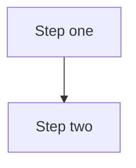

# Contributing to nextjs-skills

Thank you for helping improve this library. Contributions fall into three categories:
**fixing existing docs**, **adding a new guide**, and **adding a new agent skill**.

---

## Ground Rules

1. **Every document must stay under 1,000 lines** — the entire point of this library is that guides fit in a single LLM context window. Split large topics into separate files.
2. **No broken formatting** — no base64 images, no escaped characters from copy-paste, no inline citation numbers like `[3]`. Use Mermaid for diagrams.
3. **Working code only** — every code snippet must compile against a current stable Next.js/TypeScript version.
4. **No comments explaining what the code does** — name things well instead. Comments are for non-obvious *why*, not *what*.
5. **Agent-readable structure** — consistent use of `##` headings, tables, and fenced code blocks so agents can parse intent from structure.
6. **State which Next.js version a claim applies to** whenever behavior differs across major versions (e.g. `fetch` caching defaults changed between 14 and 15).

---

## Quick Start

```bash
git clone https://github.com/kasinadhsarma/nextjs-skills.git
cd nextjs-skills
# All content is in docs/ — no build step required
```

---

## Fixing an Existing Document

1. Fork the repository and create a branch: `fix/caching-guide-revalidate-example`
2. Make your change — keep the line count under 1,000
3. Open a pull request using the [PR template](.github/pull_request_template.md)

Small fixes (typos, broken code, outdated API names) don't need an issue first.
For structural changes to an existing guide, open an issue for discussion first.

---

## Adding a New Guide

A new guide is a markdown file in `docs/` covering a Next.js topic not already addressed.

### Checklist before submitting

- [ ] File is under 1,000 lines
- [ ] Starts with a one-paragraph summary of what the guide covers and who it's for
- [ ] Has at least one Mermaid diagram illustrating the architecture or flow
- [ ] All code examples use proper fenced code blocks with a language tag (` ```tsx `, ` ```ts `)
- [ ] No inline citation numbers — reference material belongs in a `## References` section at the end (links only, no superscript numbers in prose)
- [ ] Tested against current Next.js stable (run the code snippets)
- [ ] Notes explicitly if behavior differs between Next.js 14 and 15 (or other version boundaries)
- [ ] Added to the table in [README.md](README.md)

### Naming convention

```
docs/<Topic In Title Case>.md
```

Examples:
- `docs/Authentication Patterns.md`
- `docs/Testing Strategies.md`
- `docs/Internationalization Routing.md`

---

## Adding a New Agent Skill

Agent skills are structured markdown files that AI coding agents (Claude Code, Windsurf) use as context when assisting developers.

### Skill file structure

```markdown
---
name: nextjs-<kebab-case-name>
description: >
  One or two sentences describing WHEN this skill should activate.
  Be specific about trigger phrases and user scenarios.
agent_notes: >
  Optional — order-of-operations hints for the agent (what to read first,
  which section resolves a decision, when to run the verify checklist).
---

# <Skill Title>

(Content — AGENT RULES, decision tables/trees, step-by-step, NEVER-do examples, verify checklist)
```

The `description` field is what the agent reads to decide whether to load the skill. Make it specific and action-oriented.

### Skill placement

Skills that are standalone (not tied to an existing guide) go in `docs/skills.md` as a new `##` section, or as a separate `docs/<skill-name>-skill.md` file if they exceed 200 lines.

---

## Diagram Standards

Use [Mermaid](https://mermaid.js.org) for all diagrams — they render natively on GitHub and are version-controllable as text.

```markdown

```

**Supported diagram types used in this repo:**
- `graph TD` / `graph LR` — architecture and routing/dependency flows
- `sequenceDiagram` — request/response and auth flows
- `flowchart LR` / `flowchart TD` — decision trees and process steps

Never embed images as base64 or attach binary image files.

---

## Pull Request Process

1. One topic per PR — don't mix a new guide with fixes to an existing one
2. Fill out the [PR template](.github/pull_request_template.md) completely
3. All CI checks must pass (link validation, line count check)
4. At least one maintainer approval required before merge
5. Squash-merge preferred to keep history clean

---

## Code of Conduct

Be direct, be kind, assume good faith. Detailed technical disagreements belong in comments on the PR. Personal criticism does not belong anywhere.

---

## Questions

Open a [GitHub Discussion](https://github.com/kasinadhsarma/nextjs-skills/discussions) or use the [new skill request issue template](.github/ISSUE_TEMPLATE/new_skill.md).
