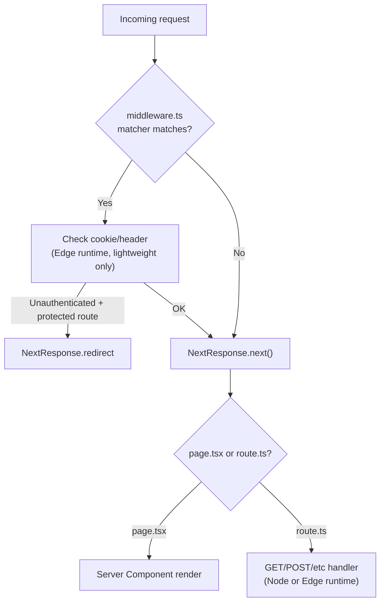

# API Routes & Middleware

Route Handlers (`route.ts`) and `middleware.ts` in the App Router — when to use each, and how caching, runtime, and auth interact with them.



---

## Route Handlers

Defined by a `route.ts`/`route.js` file inside `app/`. Export a function named after the HTTP method:

```ts
// app/api/products/route.ts
import { NextRequest, NextResponse } from 'next/server'

export async function GET(request: NextRequest) {
  const products = await db.product.findMany()
  return NextResponse.json(products)
}

export async function POST(request: NextRequest) {
  const body = await request.json()
  const product = await db.product.create({ data: body })
  return NextResponse.json(product, { status: 201 })
}
```

Supported exports: `GET`, `POST`, `PUT`, `PATCH`, `DELETE`, `HEAD`, `OPTIONS`.

Dynamic segments work the same as pages:

```ts
// app/api/products/[id]/route.ts
export async function GET(
  request: NextRequest,
  { params }: { params: Promise<{ id: string }> } // Promise in Next 15+, plain object in 14
) {
  const { id } = await params
  // ...
}
```

Reading the request:
- `request.nextUrl.searchParams` for query params
- `await request.json()` / `await request.formData()` for the body
- `request.headers.get('...')`, `request.cookies.get('...')`

Returning a response:
- `NextResponse.json(data, { status })` for JSON
- `new NextResponse(body, { headers })` for anything else (files, text, streams)
- `NextResponse.redirect(url)` for redirects

**Caching:** GET route handlers are NOT cached by default in the App Router (unlike page `fetch` calls) unless you export `export const dynamic = 'force-static'` — treat them as dynamic/on-demand by default, which matches typical API semantics.

---

## Route Handler vs Server Action — decision table

| Situation | Use |
|---|---|
| Only your own app's forms/components call it | **Server Action** — simpler, no separate endpoint, works with progressive enhancement |
| A webhook receiver (Stripe, GitHub, etc.) needs to call it | **Route Handler** |
| A third-party client, mobile app, or public API needs it | **Route Handler** |
| You need specific HTTP semantics — custom status codes, non-JSON bodies, `OPTIONS` for CORS preflight | **Route Handler** |
| It's a mutation triggered purely from your own UI | **Server Action** |

---

## `middleware.ts`

One file at the project root (or inside `src/`) that runs before a request completes, for every route matching its `config.matcher`:

```ts
// middleware.ts
import { NextResponse } from 'next/server'
import type { NextRequest } from 'next/server'

export function middleware(request: NextRequest) {
  const token = request.cookies.get('session')?.value

  if (!token && request.nextUrl.pathname.startsWith('/dashboard')) {
    return NextResponse.redirect(new URL('/login', request.url))
  }

  return NextResponse.next()
}

export const config = {
  matcher: ['/dashboard/:path*', '/api/protected/:path*'],
}
```

Key constraints:
- Middleware runs on the **Edge runtime** by default — no Node.js APIs (no `fs`, no most npm packages that assume Node). Keep it to lightweight checks: reading cookies/headers, redirects/rewrites, simple auth gating.
- Don't do database queries or heavy work in middleware — verify a session token/cookie shape, and defer real data checks to the page/Server Action.
- Use `matcher` to scope middleware to only the paths that need it — running it on every request (including static assets) adds latency for no benefit.
- `NextResponse.next()` continues the request unchanged; `NextResponse.redirect()`/`.rewrite()` change where it goes.

---

## Edge vs Node.js runtime

| Runtime | Cold start | API surface | Use for |
|---|---|---|---|
| **Edge** (`export const runtime = 'edge'`) | Fast, runs close to user | Restricted — no native Node modules, limited npm compatibility | Latency-sensitive, lightweight logic (auth checks, geolocation redirects, simple transforms) |
| **Node.js** (default) | Slower cold start | Full Node API surface | Anything touching a database driver, file system, or a Node-only SDK |

Middleware is always Edge — there's no opt-out.

---

## Auth patterns

- Common shape: middleware checks for a session cookie's *presence* and redirects unauthenticated users away from protected routes (cheap, Edge-safe). The actual session *validation* (verifying a JWT signature, checking a DB session) happens in the page/layout or Server Action, since that may need Node APIs or a DB round-trip.
- For NextAuth.js/Auth.js projects, this is exactly the split the library encourages: an Edge-safe middleware check plus full verification server-side.
- Never rely on client-side route protection alone (e.g. redirecting in a `useEffect`) for anything sensitive — always gate on the server (middleware and/or the Server Component itself).

---

## Common pitfalls

- Using a Node-only package (e.g. a database driver) inside `middleware.ts` — build/runtime error, since middleware is Edge-only.
- Forgetting `config.matcher`, causing middleware to run on every asset request unnecessarily.
- Putting `route.ts` and `page.tsx` in the same folder segment — not allowed.
- Trusting client-only redirects for auth instead of enforcing it server-side.

---

## References

- https://nextjs.org/docs/app/building-your-application/routing/route-handlers
- https://nextjs.org/docs/app/building-your-application/routing/middleware
- https://nextjs.org/docs/app/api-reference/edge
