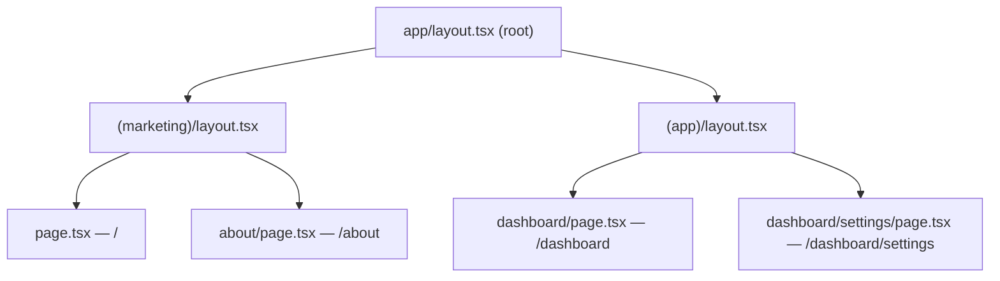
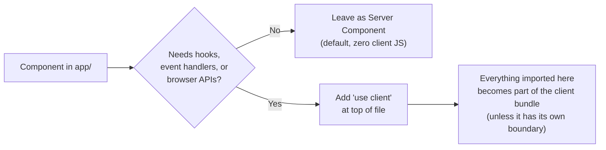
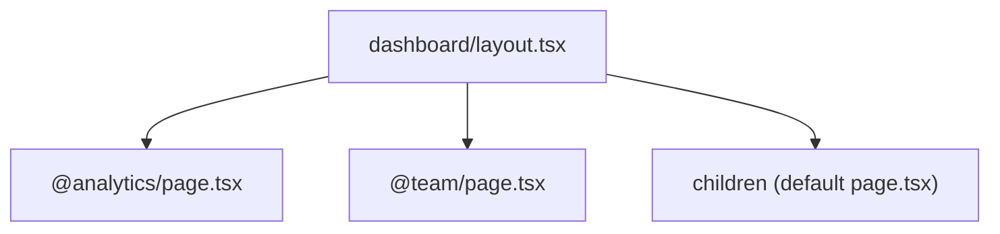

# App Router Fundamentals

The `app/` directory conventions in Next.js 13+ (App Router), current through Next.js 15. Covers file conventions, layouts, Server vs Client Components, loading/error states, route groups, and parallel/intercepting routes.



---

## File conventions

Every route segment is a folder under `app/`. Special files inside a segment folder:

| File | Purpose |
|---|---|
| `page.tsx` | Makes the segment a publicly reachable route (the actual UI) |
| `layout.tsx` | Shared UI that wraps `page.tsx` and all nested segments; preserves state across navigation |
| `template.tsx` | Like layout, but remounts on every navigation (no state persistence) — rare, use only when you need fresh state/animations per nav |
| `loading.tsx` | Instant loading UI; auto-wraps the segment in a `<Suspense>` boundary |
| `error.tsx` | Error boundary for the segment; **must** be a Client Component (`"use client"`) |
| `not-found.tsx` | Rendered when `notFound()` is called or a segment doesn't match |
| `route.ts` | API endpoint for this segment (mutually exclusive with `page.tsx` in the same segment) |
| `default.tsx` | Fallback for a parallel route slot when no match |

Folder naming conventions:

| Pattern | Meaning |
|---|---|
| `[slug]` | Dynamic segment (`params.slug`) |
| `[...slug]` | Catch-all segment (`params.slug` is an array) |
| `[[...slug]]` | Optional catch-all (matches the parent route too) |
| `(groupName)` | Route group; organizes routes/layouts without adding a URL segment |
| `@slotName` | Parallel route slot (rendered alongside siblings in a shared layout) |

---

## Server Components vs Client Components



- Everything under `app/` is a **Server Component by default**. No `"use client"` needed, no JS shipped to the browser for that component.
- Add `"use client"` only when the component needs: `useState`/`useEffect`/other hooks, event handlers (`onClick`, etc.), browser-only APIs, or a third-party library that assumes the browser.
- `"use client"` marks a **boundary**, not just one file — everything imported into that file (unless it itself has its own boundary) becomes part of the client bundle. Keep client boundaries as low/leaf-like in the tree as possible.
- Server Components can `import` and render Client Components, but not vice versa directly — pass Server Components down as `children`/props to Client Components if you need to nest a server-rendered piece inside client-interactive UI.
- Server Components can be `async` and fetch data directly (`await fetch(...)` or a DB call) — no `getServerSideProps` needed.

---

## Layouts

- Layouts nest: root `app/layout.tsx` (required, must include `<html>`/`<body>`) wraps every nested layout down to the matching `page.tsx`.
- Layouts receive `children` and, for parallel routes, the slot props (`@slotName`).
- Layouts do NOT re-render on navigation between sibling pages under them — only the changed segment's `page.tsx` (and anything below the layout) updates. Don't put per-page state in a layout expecting it to reset.
- `params` are available to layouts/pages as an async prop in recent versions:

```tsx
async function Page({ params }: { params: Promise<{ slug: string }> }) {
  const { slug } = await params
  return <div>{slug}</div>
}
```

Always check the installed Next.js version's typing — this signature changed between 14 (plain object) and 15 (Promise).

---

## Loading & error states

- `loading.tsx` in a segment folder automatically Suspense-wraps that segment; it shows while the segment's data-fetching (async Server Component) is in flight.
- `error.tsx` catches errors thrown during rendering of its segment and below. It receives `{ error, reset }` — `reset()` re-attempts rendering the segment.
- `global-error.tsx` at the root catches errors in the root layout itself (rare).
- For expected "not found" states, call `notFound()` from `next/navigation` inside a Server Component rather than throwing — it renders the nearest `not-found.tsx`.

---

## Route groups `(name)`

Use to:
- Apply a different layout to a subset of routes without changing the URL, e.g. `app/(marketing)/layout.tsx` vs `app/(app)/layout.tsx`.
- Organize routes by concern (`(auth)`, `(dashboard)`) purely for file-tree clarity.

The parenthesized segment is stripped from the URL entirely.

---

## Parallel routes `@slot` and intercepting routes `(.)`



- Parallel routes let a layout render multiple independent pages in the same view (e.g. a dashboard with `@analytics` and `@team` slots) — each slot has its own `loading.tsx`/`error.tsx` and streams independently.
- Intercepting routes (`(.)folder`, `(..)folder`, `(...)folder`) let a route "intercept" navigation to show a different UI (e.g. a modal) while preserving the underlying URL, commonly combined with parallel routes for the classic "photo modal that's also a full page on refresh" pattern.
- These are advanced/rare — reach for them only when a modal-that's-also-a-route or multi-pane dashboard is the actual requirement, not by default.

---

## Metadata

- Export `metadata` (static object) or `generateMetadata()` (async function) from `page.tsx`/`layout.tsx` for `<title>`, `<meta>`, OpenGraph, etc. Don't hand-write `<head>` tags.
- `generateMetadata` can be async and fetch data — useful for per-item titles (e.g. product name in `<title>`).

---

## Common pitfalls

- Forgetting `"use client"` on a component that uses `onClick`/`useState` → build error or silent no-op depending on version.
- Putting a `route.ts` and `page.tsx` in the same folder — not allowed, pick one.
- Expecting a layout to re-run on every navigation — it won't; put per-navigation logic in the page or a client-side listener instead.
- Importing a large client-only library at the top of a Server Component file without a `"use client"` boundary, unintentionally growing the client bundle.

---

## References

- https://nextjs.org/docs/app/building-your-application/routing
- https://nextjs.org/docs/app/building-your-application/rendering/server-components
- https://nextjs.org/docs/app/building-your-application/routing/parallel-routes
