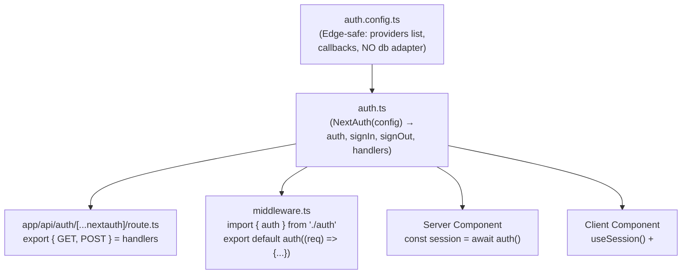

# Authentication (NextAuth / Auth.js)

Auth.js (the project formerly known as NextAuth.js — v5 is published as `next-auth@beta` under the `Auth.js` name) integration with the App Router. Distinct from [Authentication Patterns (Firebase)](Authentication%20Patterns%20%28Firebase%29.md), which covers a hand-rolled Firebase Auth + `firebase-admin` setup — use this doc when the project uses (or should use) Auth.js/NextAuth instead.



---

## v4 vs v5 (Auth.js) — check which one a project is on

| | NextAuth v4 | Auth.js v5 (`next-auth@5`, beta as of this writing) |
|---|---|---|
| Package | `next-auth` | `next-auth` (same package, new major) |
| Config location | `app/api/auth/[...nextauth]/route.ts` (inline `authOptions`) | Separate `auth.ts` at project root, config split out |
| Getting a session server-side | `getServerSession(authOptions)` | `await auth()` |
| Middleware | `withAuth` wrapper | `export default auth(...)` from `auth.ts` |
| Env var | `NEXTAUTH_SECRET`, `NEXTAUTH_URL` | `AUTH_SECRET` (v4 names still work) |

Always confirm the installed major version (`package.json`) before writing config — the two APIs are shaped differently enough that copying v4 examples into a v5 project (or vice versa) won't compile.

---

## v5 setup — the split-config pattern

Auth.js v5 recommends splitting config into an **Edge-safe** part and a **full** part, because `middleware.ts` runs on the Edge runtime and can't use Node-only providers/adapters (e.g. a database adapter using a Node Postgres driver):

```ts
// auth.config.ts — Edge-safe: no database adapter, no Node-only imports
import type { NextAuthConfig } from 'next-auth';
import Credentials from 'next-auth/providers/credentials';

export const authConfig: NextAuthConfig = {
  pages: { signIn: '/login' },
  callbacks: {
    authorized({ auth, request: { nextUrl } }) {
      const isLoggedIn = !!auth?.user;
      const isProtected = nextUrl.pathname.startsWith('/dashboard');
      if (isProtected) return isLoggedIn;
      return true;
    },
  },
  providers: [], // populated in the full config below
} satisfies NextAuthConfig;
```

```ts
// auth.ts — full config, Node runtime, used everywhere except middleware
import NextAuth from 'next-auth';
import Credentials from 'next-auth/providers/credentials';
import { authConfig } from './auth.config';
import { getUserByEmail } from '@/lib/db';

export const { handlers, auth, signIn, signOut } = NextAuth({
  ...authConfig,
  providers: [
    Credentials({
      async authorize(credentials) {
        const user = await getUserByEmail(credentials.email as string);
        // verify password hash here — never return a user without checking it
        return user ?? null;
      },
    }),
  ],
});
```

```ts
// app/api/auth/[...nextauth]/route.ts
export { GET, POST } from '@/auth';
```

```ts
// middleware.ts — Edge-safe, uses only auth.config.ts's callbacks
import NextAuth from 'next-auth';
import { authConfig } from './auth.config';

export default NextAuth(authConfig).auth;

export const config = {
  matcher: ['/((?!api|_next/static|_next/image|.*\\.png$).*)'],
};
```

---

## Reading the session

| Context | How |
|---|---|
| Server Component | `const session = await auth();` (imported from `auth.ts`) |
| Server Action / Route Handler | Same — `await auth()` works anywhere on the server |
| Client Component | `const { data: session, status } = useSession();` — requires `<SessionProvider>` wrapping the tree (in the root layout, as a Client Component) |
| Middleware | The `auth` callback in `authConfig.callbacks.authorized` — see split-config example above |

```tsx
// app/providers.tsx
'use client';
import { SessionProvider } from 'next-auth/react';
export function Providers({ children }: { children: React.ReactNode }) {
  return <SessionProvider>{children}</SessionProvider>;
}
```

`<SessionProvider>` must wrap Client Components that call `useSession()` — it does not need to wrap the whole app if only a subtree needs client-side session access, but it's simplest to put it once in the root layout.

---

## Callbacks — where to put custom logic

```ts
callbacks: {
  async jwt({ token, user }) {
    if (user) token.role = user.role; // runs on sign-in, persists into the JWT
    return token;
  },
  async session({ session, token }) {
    session.user.role = token.role as string; // exposes it on the session object
    return session;
  },
  async signIn({ user, account }) {
    if (account?.provider === 'google' && !user.email?.endsWith('@company.com')) {
      return false; // reject sign-in
    }
    return true;
  },
},
```

- `jwt` runs whenever a JWT is created/updated — this is where you attach custom claims (role, permissions) that came from your database at sign-in time.
- `session` runs whenever a session is checked — it shapes what `auth()`/`useSession()` actually returns. Data not copied from `token` into `session` here is invisible to the rest of the app.
- `signIn` returning `false` (or throwing) blocks the sign-in attempt entirely — use it for allow-listing domains, checking ban status, etc.

---

## Session strategy: JWT vs database

| Strategy | How it works | Use when |
|---|---|---|
| `strategy: 'jwt'` (default with Credentials provider) | Session state is encoded entirely in a signed cookie | No database, or Edge-runtime session reads needed, simplest to run |
| `strategy: 'database'` | Session ID in cookie, session data in your DB via an adapter | Need to revoke a session immediately (JWTs can't be revoked before expiry without a blocklist), or session data is large/frequently changing |

The Credentials provider **requires** JWT strategy (no database adapter can attach to it in the way OAuth providers do) — this is an Auth.js constraint, not a config choice, when using Credentials.

---

## Common pitfalls

- Putting a Node-only database adapter in the config object used by `middleware.ts` — breaks because middleware is Edge-only. Use the split `auth.config.ts`/`auth.ts` pattern.
- Forgetting `AUTH_SECRET` (or `NEXTAUTH_SECRET`) in production — required to sign JWTs/cookies; without it, sessions silently fail to persist or a build warning appears.
- Not setting `trustHost: true` (or the equivalent env var) when deployed behind a reverse proxy/load balancer that changes the host header — sign-in redirects can loop or fail.
- Reading `session.user.role` (or any custom field) without first threading it through both the `jwt` and `session` callbacks — custom fields don't appear on the session object automatically.
- Mixing v4 (`getServerSession(authOptions)`) and v5 (`auth()`) API examples from documentation/tutorials without checking which major version is actually installed.

---

## Verification checklist

- [ ] Confirmed installed `next-auth` major version before following v4 vs v5 patterns
- [ ] `middleware.ts` only imports Edge-safe config (no database adapter, no Node-only providers)
- [ ] `AUTH_SECRET`/`NEXTAUTH_SECRET` is set in every deployment environment, not just local `.env`
- [ ] Custom session fields are threaded through both `jwt` and `session` callbacks
- [ ] Protected routes are actually covered by the middleware `matcher`, and/or re-checked server-side in the page/Server Action (never trust middleware alone for highly sensitive routes)

---

## References

- https://authjs.dev/getting-started/installation
- https://authjs.dev/guides/edge-compatibility
- [Authentication Patterns (Firebase)](Authentication%20Patterns%20%28Firebase%29.md) — the alternative hand-rolled approach used in `ropods-store`
