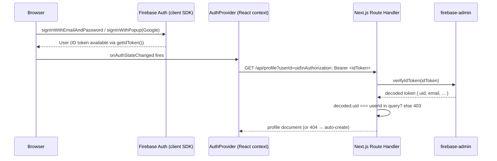

# Authentication Patterns (Firebase)

How `ropods-store` handles authentication: Firebase client SDK for sign-in, a React context that keeps the app-level `user`/`profile` state in sync, and server-side ID token verification via `firebase-admin` on every route that must know *who* is calling. Captured from the live implementation (2026-07).



---

## Client-side: Firebase Auth SDK (`lib/auth/firebase-auth.ts`)

A thin wrapper around the Firebase client SDK, re-exporting only what the app needs:

```ts
export const signIn = async (email: string, password: string) => {
  const userCredential = await signInWithEmailAndPassword(auth, email, password);
  return { user: userCredential.user, error: null };
};

export const signInWithGoogle = async () => {
  const userCredential = await signInWithPopup(auth, new GoogleAuthProvider());
  return { user: userCredential.user, error: null };
};

export const signOut = async () => { await firebaseSignOut(auth); };
export const resetPassword = async (email: string) => { await sendPasswordResetEmail(auth, email); };
export { auth, onAuthStateChanged };
```

Every function returns `{ user, error }` (or `{ error }`) instead of throwing — callers check `error` rather than wrapping every call in `try/catch`. Firebase config comes entirely from `NEXT_PUBLIC_FIREBASE_*` env vars, which is correct: the Firebase Web SDK config is not a secret (it identifies the project, not a credential) and is safe to ship to the client.

---

## App-level state: `AuthProvider` (`components/auth/AuthProvider.tsx`)

A `"use client"` context that subscribes to `onAuthStateChanged` once, and layers an app-specific `profile` document on top of the raw Firebase `User`:

```tsx
useEffect(() => {
  const unsubscribe = onAuthStateChanged(auth, async (currentUser) => {
    setUser(currentUser);
    if (currentUser) await fetchProfile(currentUser);
    else setProfile(null);
    setLoading(false);
  });
  return () => unsubscribe();
}, []);
```

`fetchProfile` calls `GET /api/profile?userId=<uid>` with the ID token attached, and **auto-creates the profile document on a 404**:

```ts
const token = await currentUser.getIdToken();
const response = await fetch(`/api/profile?userId=${currentUser.uid}`, {
  headers: { Authorization: `Bearer ${token}` },
});
if (response.status === 404) {
  await fetch('/api/profile', {
    method: 'POST',
    headers: { 'Content-Type': 'application/json', Authorization: `Bearer ${token}` },
    body: JSON.stringify({ userId: currentUser.uid, email: currentUser.email, name: currentUser.displayName || '' }),
  });
}
```

This means "sign up" isn't a single explicit step server-side — the first authenticated request after account creation lazily provisions the app-level profile document. Anything that reads `profile` (not `user`) must tolerate a brief window where `profile` is `null` right after sign-in while this round trip completes.

---

## Server-side: verifying the ID token (`lib/auth/firebase-admin.ts` + route handlers)

The client SDK's ID token is a JWT the client can present, but a route handler must **independently verify it** — never trust a `userId` in the request body/query alone. `firebase-admin` does this:

```ts
// lib/auth/firebase-admin.ts
export function getAdminAuth() {
  if (!getApps().length) {
    const serviceAccount = JSON.parse(process.env.FIREBASE_SERVICE_ACCOUNT_KEY!) as ServiceAccount;
    initializeApp({ credential: cert(serviceAccount) });
  }
  return getAuth();
}
```

The reusable pattern, from `app/api/profile/route.ts`:

```ts
async function verifyAuth(request: NextRequest, targetUserId?: string) {
  const authHeader = request.headers.get('Authorization');
  if (!authHeader?.startsWith('Bearer ')) return null;

  const token = authHeader.split('Bearer ')[1];
  try {
    const decodedToken = await getAdminAuth().verifyIdToken(token);

    // Not just "is this token valid" — "does it belong to the user being accessed"
    if (targetUserId && decodedToken.uid !== targetUserId) {
      return { error: 'Unauthorized: User ID mismatch', status: 403 };
    }
    return { uid: decodedToken.uid };
  } catch (error) {
    console.error('Error verifying token:', error);
    return null; // expired/invalid/malformed token → treat as unauthenticated
  }
}
```

Two checks happen, and **both are required**:
1. `verifyIdToken` proves the token is a genuine, unexpired Firebase ID token — this is the authentication step.
2. `decodedToken.uid !== targetUserId` proves the caller is asking about *their own* data, not someone else's — this is the authorization step. **Authentication alone is not enough**: a valid token for user A must not be usable to read or modify user B's data just because A can construct a request with B's `userId` in it. See [Profile & Account Patterns](Profile%20%26%20Account%20Patterns.md) for a live example of what happens when this second check is skipped.

---

## Env variable boundaries

| Variable | Where used | Exposed to client? |
|---|---|---|
| `NEXT_PUBLIC_FIREBASE_API_KEY` / `AUTH_DOMAIN` / `PROJECT_ID` / etc. | Client SDK init | Yes — intentionally; identifies the project, not a secret credential |
| `FIREBASE_SERVICE_ACCOUNT_KEY` | Server: `firebase-admin` init, `verifyIdToken`, `getUserByEmail`, `createUser` | **Never** — this grants full admin access to the Firebase project |

Losing the `NEXT_PUBLIC_*` Firebase config is not a security incident (Firebase's actual security boundary is its security rules / server-side checks, not obscurity of these values). Losing `FIREBASE_SERVICE_ACCOUNT_KEY` is a full project compromise — treat it like any other server secret (never logged, never in a client bundle, never committed).

---

## Common pitfalls

- **Trusting a `userId` from the request without verifying the token belongs to that user.** Verifying *a* valid token is not the same as verifying *this* token owns the resource being accessed — always compare `decodedToken.uid` to the resource's owner.
- Forgetting that a route with no callers in your current UI is still a live, publicly reachable endpoint — dead-code-in-your-own-app is not the same as unreachable.
- Assuming `profile` is populated immediately after `user` becomes non-null — there's an async round trip (and possibly an auto-create POST) in between.
- Logging the full Firebase ID token or the service account key, even in error paths.
- Reusing the client Firebase config object for anything security-sensitive — it's not a secret and provides no access control by itself.

---

## Verification checklist

- [ ] Every route that reads/writes user-specific data verifies the `Authorization: Bearer <token>` header with `getAdminAuth().verifyIdToken()`
- [ ] The decoded token's `uid` is compared against the resource owner (`userId` in the query/body) — not just "is the token valid"
- [ ] `FIREBASE_SERVICE_ACCOUNT_KEY` never appears in logs, client bundles, or committed files
- [ ] New sub-routes under an already-authenticated resource (e.g. `/api/profile/*`) inherit the same auth check — it does not carry over automatically from the parent route
- [ ] UI code tolerates `profile === null` while it's still loading, distinct from "no profile exists"

---

## References

- https://firebase.google.com/docs/auth/admin/verify-id-tokens
- https://firebase.google.com/docs/auth/web/start
- [Profile & Account Patterns](Profile%20%26%20Account%20Patterns.md) — the resource-ownership check this doc describes, and a live example of what happens when a sub-route omits it
