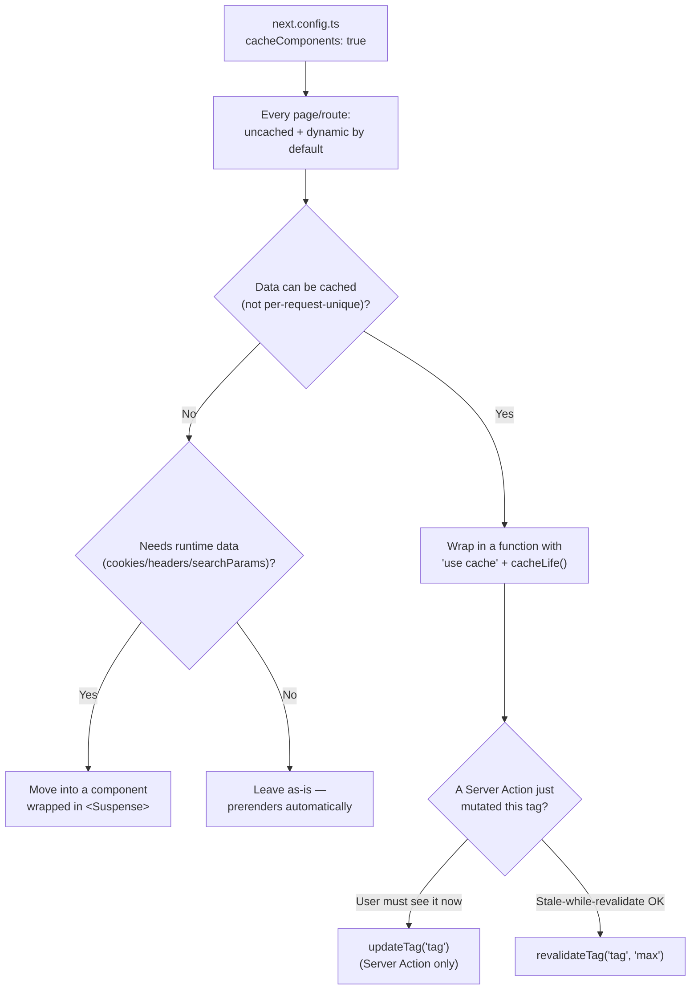

# Cache Components & Partial Prerendering (Next.js 16)

Next.js 16 replaces the route-segment-config caching model (`dynamic`, `revalidate`, `fetchCache`, `unstable_cache`) with **Cache Components**: an explicit `'use cache'` directive plus `cacheLife`/`cacheTag`, combined with Partial Prerendering (PPR) so a single page can have a static shell and streamed dynamic sections. If a project targets Next.js 16+, read this doc *instead of* (or alongside, for context) [Data Fetching And Caching](Data%20Fetching%20And%20Caching.md), which documents the pre-16 model still used by most existing projects and still valid without the `cacheComponents` flag enabled.



---

## The core shift: everything is uncached and dynamic by default

With `cacheComponents: true` in `next.config.ts`, Next.js **stops guessing** whether a page is static or dynamic — it errors in development, naming the exact line, when it finds uncached data access or runtime data (`cookies()`, `headers()`, `searchParams`) that isn't explicitly handled. This is a deliberate design choice: the framework won't silently make a route dynamic because of one stray `cookies()` call buried three components deep — it forces the decision to be visible in the code.

```ts
// next.config.ts
import type { NextConfig } from 'next'

const nextConfig: NextConfig = {
  cacheComponents: true, // requires Next.js 16
}
export default nextConfig
```

This flag replaces the earlier `experimental.dynamicIO` and `experimental.useCache` flags, and removes `experimental_ppr` entirely — Partial Prerendering is no longer a separate opt-in, it's part of Cache Components.

---

## Migration map: old config → new primitive

| Old (route segment config / pre-16) | New (Cache Components) |
|---|---|
| `export const dynamic = 'force-dynamic'` | **Delete it** — everything is dynamic by default now |
| `export const dynamic = 'force-static'` | Delete it; add `'use cache'` (with `cacheLife('max')`) around the data access that needs to stay cached |
| `export const revalidate = 3600` | `cacheLife('hours')` (or a custom profile) inside a `'use cache'` function |
| `export const fetchCache = 'force-cache'` | Delete it — everything inside a `'use cache'` scope is cached automatically |
| `fetch(url, { cache: 'force-cache', next: { revalidate, tags } })` | Wrap the fetch in a `'use cache'` function; move `revalidate`→`cacheLife()`, `tags`→`cacheTag()` |
| `unstable_cache(fn, keyParts, { tags, revalidate })` | Add `'use cache'` directly inside `fn`; the cache key is derived automatically — no more manual `keyParts` array |
| `unstable_noStore()` | Delete it — nothing is cached unless you opt in with `'use cache'` |
| `experimental_ppr = true` | Delete it — enabling `cacheComponents` turns PPR on implicitly |

```ts
// Before (pre-16 / previous model)
export const revalidate = 3600
export default async function Page() {
  const res = await fetch('https://api.example.com/data', {
    cache: 'force-cache',
    next: { revalidate: 3600, tags: ['data'] },
  })
  return <div>{await res.json()}</div>
}
```

```ts
// After (Cache Components)
import { cacheLife, cacheTag } from 'next/cache'

async function getData() {
  'use cache'
  cacheLife('hours')
  cacheTag('data')
  const res = await fetch('https://api.example.com/data')
  return res.json()
}

export default async function Page() {
  return <div>{await getData()}</div>
}
```

Note where `'use cache'` goes: on the **data-fetching function**, not necessarily the page itself — this is what enables caching one expensive query independently of the rest of the page, rather than the old all-or-nothing per-route model.

---

## Runtime data (`cookies`, `headers`, `searchParams`) must move into `<Suspense>`

Previously, calling `cookies()` anywhere in a Server Component silently made the *entire route* dynamic. Under Cache Components, doing that outside a `<Suspense>` boundary is a build/dev-time error instead — you have to explicitly isolate it:

```tsx
// Before — reading cookies at the top makes the whole route dynamic
export default async function Page() {
  const theme = (await cookies()).get('theme')?.value
  return <Dashboard theme={theme} />
}
```

```tsx
// After — the page prerenders as a static shell; only Dashboard streams at request time
export default function Page() {
  return (
    <Suspense fallback={<p>Loading...</p>}>
      <Dashboard />
    </Suspense>
  )
}
async function Dashboard() {
  const theme = (await cookies()).get('theme')?.value
  // ...
}
```

`params` and `searchParams` (both promises on the page component) follow the same pattern — pass the promise down into the `<Suspense>`-wrapped component and `await` it there, rather than awaiting it at the top of the page.

---

## Choosing between `updateTag`, `revalidateTag`, and `revalidatePath`

| Function | Behavior | Callable from |
|---|---|---|
| `updateTag('tag')` | Expires the tag so the **next request waits** for fresh data — use when the user must see their own mutation immediately (read-your-own-writes) | **Server Actions only** — throws elsewhere |
| `revalidateTag('tag', 'max')` | Stale-while-revalidate — serves cached data while it refreshes in the background | Server Actions and Route Handlers |
| `revalidatePath('/path')` | Unchanged from the previous model | Server Actions and Route Handlers |

```ts
'use server'
import { updateTag } from 'next/cache'

export async function createPost(formData: FormData) {
  await db.post.create({ /* ... */ })
  updateTag('posts'); // the user's own next page load sees the new post, no stale flash
}
```

Use `updateTag` specifically for the "I just submitted a form, show me the result" case; reach for `revalidateTag` when a slightly stale response for a moment is acceptable (e.g. a webhook-triggered content update that other users will see shortly after, not instantly).

---

## Storage: `use cache` is not the same durability as the old `fetch` cache

`'use cache'` defaults to **in-memory** storage — entries are discarded when the serverless instance recycles, and are scoped to a single deployment. The old `fetch` Data Cache and `unstable_cache` persisted across deployments and serverless instances. If a cached value needs to survive instance teardown, use `'use cache: remote'` or configure a [cache handler](https://nextjs.org/docs/app/api-reference/config/next-config-js/cacheHandlers) — and expect cached values to recompute after every new deployment regardless.

---

## Other behavior changes to know about

- **`generateStaticParams` can no longer return `[]`.** Previously an empty array deferred every path to first-request rendering; under Cache Components it's a build error (`empty-generate-static-params`) — return at least one param.
- **`runtime = 'edge'` is not supported** with Cache Components enabled — it requires the Node.js runtime. Use [Proxy](https://nextjs.org/docs/app/api-reference/file-conventions/proxy) (the renamed middleware-equivalent) for edge-specific routes instead.
- **`GET` Route Handlers** follow the same rule as pages now: move cacheable data access into a separate `'use cache'`-marked helper function — the directive can't go directly on the exported `GET`.
- **UI state now persists across navigation.** Next.js preserves routes with React's `<Activity>` component in `"hidden"` mode instead of unmounting them — `useState`, form inputs, and scroll position survive a back-navigation. Dropdowns/dialogs that relied on unmount-to-reset need explicit cleanup logic (e.g. close a dropdown in a `useLayoutEffect` cleanup, derive dialog open-state from the URL instead of local mount state).

---

## The underlying model: static/dynamic is a spectrum, not a route-level switch

Most frameworks draw the static/dynamic line at the **route** level — a page is either fully prerendered or fully server-rendered. Next.js draws it at the **component** level: a single page can have a static shell that loads instantly, one function cached independently with its own `cacheLife`, and a small dynamic section streaming in via `<Suspense>` — all in one response, without splitting into separate routes or client-side fetches. This is *why* the migration above is framed around wrapping specific functions/components rather than configuring a whole route: the granularity moved down a level.

---

## Common pitfalls

- Copying pre-16 caching advice (route segment configs) into a `cacheComponents: true` project — those exports are ignored or actively unneeded now; follow the migration map above instead.
- Reading `cookies()`/`headers()`/`searchParams` at the top of a page component instead of inside a `<Suspense>`-wrapped child — this now surfaces as a build-time error rather than silently working.
- Assuming `'use cache'` persists like the old `fetch` Data Cache — it's in-memory and per-deployment by default; use `'use cache: remote'` or a cache handler if durability across instances/deployments matters.
- Calling `updateTag` from a Route Handler or webhook — it only works inside Server Actions; use `revalidateTag` there instead.
- Returning `[]` from `generateStaticParams` expecting deferred-to-runtime behavior — it's now a build error under Cache Components.
- Setting `runtime = 'edge'` on a route while `cacheComponents` is enabled globally — not supported.

---

## Verification checklist

- [ ] Confirmed the project is actually on Next.js 16+ with `cacheComponents: true` before applying any guidance in this doc (see [Data Fetching And Caching](Data%20Fetching%20And%20Caching.md) for pre-16 projects instead)
- [ ] All route segment configs (`dynamic`, `revalidate`, `fetchCache`) removed and replaced per the migration map
- [ ] Every `cookies()`/`headers()`/`searchParams` read lives inside a `<Suspense>`-wrapped component, not at the top of the page
- [ ] Mutations that need read-your-own-writes behavior use `updateTag` from the Server Action, not `revalidateTag`
- [ ] Any cached value that must survive a redeploy or instance recycle uses `'use cache: remote'` or a cache handler, not the in-memory default
- [ ] No `runtime = 'edge'` routes remain if `cacheComponents` is enabled project-wide

---

## References

- https://nextjs.org/docs/app/guides/migrating-to-cache-components
- https://nextjs.org/docs/app/guides/rendering-philosophy
- https://nextjs.org/docs/app/api-reference/directives/use-cache
- [Data Fetching And Caching](Data%20Fetching%20And%20Caching.md) — the pre-16 model this doc supersedes for `cacheComponents` projects
