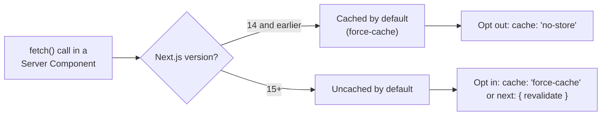
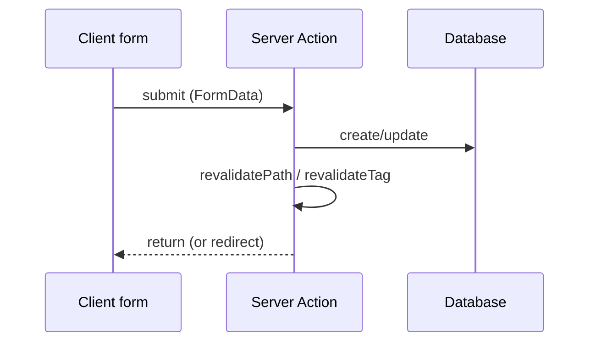

# Data Fetching & Caching

`fetch` caching, ISR, Server Actions, and streaming in the App Router. Caching semantics changed significantly between Next.js 14 and 15 — verify the installed version before assuming defaults.



---

## `fetch` caching semantics

- **Next.js 14 and earlier**: `fetch` requests inside Server Components were cached (`force-cache`) by default. You opted OUT with `{ cache: 'no-store' }` or `{ next: { revalidate: 0 } }`.
- **Next.js 15+**: the default flipped — `fetch` is **uncached** by default. You opt IN to caching explicitly with `{ cache: 'force-cache' }` or `{ next: { revalidate: <seconds> } }`.
- Always check `package.json` for the actual major version before writing caching code — assuming the wrong default silently over- or under-fetches.

```ts
// Cache indefinitely until manually revalidated
fetch(url, { cache: 'force-cache' })

// Time-based revalidation (ISR-style) — revalidate at most every 60s
fetch(url, { next: { revalidate: 60 } })

// Tag for on-demand invalidation
fetch(url, { next: { tags: ['products'] } })

// Never cache (always fresh, e.g. per-request personalized data)
fetch(url, { cache: 'no-store' })
```

---

## Route/segment-level config

Set on a `page.tsx`/`layout.tsx`/`route.ts` to control the whole segment:

```ts
export const revalidate = 60          // ISR: regenerate at most every 60s
export const dynamic = 'force-dynamic' // opt this route out of static rendering entirely
export const dynamic = 'force-static'  // force static even if it reads dynamic APIs
export const fetchCache = 'default-cache' // override fetch default for this segment
```

Reading `cookies()`, `headers()`, or `searchParams` in a Server Component makes that segment dynamic automatically (can't be statically cached) — this is usually the right behavior and rarely needs overriding.

---

## Revalidating on demand

Use when data changes from a mutation and you want the cache invalidated immediately rather than waiting for the time-based window:

```ts
import { revalidatePath, revalidateTag } from 'next/cache'

revalidatePath('/products')       // invalidate everything rendered by this path
revalidateTag('products')         // invalidate every fetch tagged 'products', wherever it's called from
```

`revalidateTag` is usually the better primitive — it decouples cache invalidation from route structure, so a change to "products" data invalidates every page that reads it, not just one path.

---

## Server Actions

Server Actions are async functions that run on the server, callable directly from Client (or Server) Components — the modern replacement for hand-rolled API routes for form submissions/mutations.



```ts
// app/actions.ts
'use server'

export async function createPost(formData: FormData) {
  const title = formData.get('title') as string
  await db.post.create({ data: { title } })
  revalidatePath('/posts')
}
```

```tsx
// Client Component
'use client'
import { createPost } from './actions'

export function NewPostForm() {
  return (
    <form action={createPost}>
      <input name="title" />
      <button type="submit">Create</button>
    </form>
  )
}
```

Key points:
- `'use server'` at the top of the file (or inline in a function) marks it as a Server Action — Next.js generates a secure RPC endpoint for it automatically.
- Can be passed directly to a `<form action={...}>` (progressive enhancement — works without JS) or called imperatively from an event handler.
- Use `useFormState`/`useActionState` (React) for returning validation errors back to the form, and `useFormStatus` for pending UI.
- **Always re-validate/authorize inside the action itself** — it's a public endpoint even though it looks like a plain function call. Never trust that only your form calls it.
- Call `revalidatePath`/`revalidateTag` inside the action after a mutation so the UI reflects the change without a manual refresh.

---

## Streaming with Suspense

Wrap a slow, independent piece of a Server Component tree in `<Suspense>` so the rest of the page can render (and be sent to the browser) immediately while that piece streams in later:

```tsx
import { Suspense } from 'react'

export default function Page() {
  return (
    <>
      <Header />
      <Suspense fallback={<ProductsSkeleton />}>
        <SlowProductList /> {/* async Server Component, awaits its own data */}
      </Suspense>
    </>
  )
}
```

This composes with `loading.tsx` (which is really just an implicit `<Suspense>` around the whole segment) — use explicit `<Suspense>` when only part of a page should show a skeleton, not the whole route.

---

## Common pitfalls

- Assuming Next.js 14 caching defaults on a Next.js 15 project (or vice versa) — check the version.
- Forgetting to call `revalidatePath`/`revalidateTag` after a Server Action mutation, leading to stale cached UI.
- Doing sensitive authorization checks only in the UI layer and not inside the Server Action itself.
- Wrapping the entire page in one giant `<Suspense>` when only one slow section needs it — kills the benefit of streaming the rest.

---

## References

- https://nextjs.org/docs/app/building-your-application/caching
- https://nextjs.org/docs/app/building-your-application/data-fetching/server-actions-and-mutations
- https://nextjs.org/docs/app/api-reference/functions/revalidateTag
