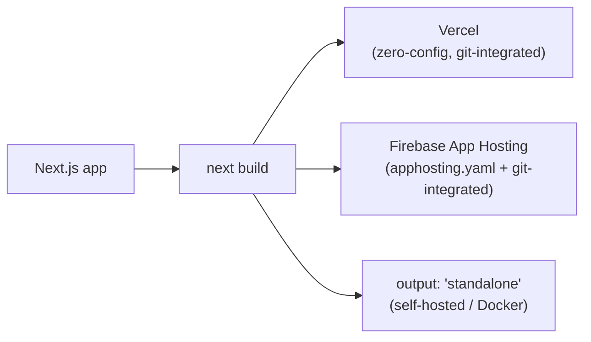

# Deployment & Config

`next.config.ts`, environment variables, image/font optimization, and deploying to Vercel or Firebase App Hosting.



---

## `next.config.ts`

Modern projects use `next.config.ts` (TypeScript) or `next.config.mjs`; older ones use `next.config.js`. Common options:

```ts
import type { NextConfig } from 'next'

const nextConfig: NextConfig = {
  images: {
    remotePatterns: [
      { protocol: 'https', hostname: 'cdn.example.com' },
    ],
  },
  reactStrictMode: true,
  eslint: { ignoreDuringBuilds: false },
  typescript: { ignoreBuildErrors: false },
  async redirects() {
    return [{ source: '/old', destination: '/new', permanent: true }]
  },
  async rewrites() {
    return [{ source: '/api/proxy/:path*', destination: 'https://backend.example.com/:path*' }]
  },
  async headers() {
    return [
      {
        source: '/(.*)',
        headers: [{ key: 'X-Frame-Options', value: 'DENY' }],
      },
    ]
  },
}

export default nextConfig
```

- `images.remotePatterns` is required (allowlist) before `next/image` can load images from an external domain — a common first error on a fresh project.
- `ignoreBuildErrors`/`ignoreDuringBuilds` should stay `false` in real projects — turning them on to "make the build pass" just moves the failure to production.
- `output: 'standalone'` produces a minimal self-contained server bundle — useful for Docker deploys.

---

## Environment variables

| File | Purpose | Committed? |
|---|---|---|
| `.env.local` | Local secrets | Never (must be in `.gitignore`) |
| `.env` | Shared defaults, all environments | OK if no secrets |
| `.env.development` / `.env.production` | Per-environment defaults | OK if no secrets |

- Only variables prefixed `NEXT_PUBLIC_` are exposed to the browser bundle; everything else is server-only and safe for secrets (API keys, DB URLs).
- Access via `process.env.NAME` — Next.js inlines `NEXT_PUBLIC_*` values at build time, so changing them requires a rebuild, not just a redeploy of the same build.
- **Never** put a real secret in a `NEXT_PUBLIC_*` variable — it ships to every client, permanently, in every build that included it.

---

## Image optimization (`next/image`)

```tsx
import Image from 'next/image'

<Image src="/hero.png" alt="Hero" width={1200} height={600} priority />
```

- `next/image` auto-serves responsive, modern-format (WebP/AVIF) images and lazy-loads by default — use `priority` only for above-the-fold/LCP images.
- Remote images need `images.remotePatterns` in `next.config.ts` (see above); local images under `public/` work with no config.
- Prefer explicit `width`/`height` (or `fill` with a sized parent) to avoid layout shift.

---

## Font optimization (`next/font`)

```tsx
import { Inter } from 'next/font/google'

const inter = Inter({ subsets: ['latin'] })

export default function RootLayout({ children }: { children: React.ReactNode }) {
  return (
    <html lang="en" className={inter.className}>
      <body>{children}</body>
    </html>
  )
}
```

`next/font` self-hosts Google Fonts at build time (no runtime request to Google, no layout shift from late-loading fonts) — always prefer this over a `<link>` tag to Google Fonts.

---

## Deploying to Vercel

- Zero-config for a standard Next.js app — connect the repo, Vercel detects the framework and sets build/output settings automatically.
- Environment variables are set in the project dashboard (Settings → Environment Variables), scoped per environment (Production/Preview/Development).
- Preview deployments are automatic per-branch/PR — useful for reviewing a change before merging.
- ISR (`revalidate`) and on-demand revalidation work natively; Server Actions and Edge middleware are fully supported.

---

## Deploying to Firebase App Hosting

- Firebase App Hosting is Firebase's Next.js-native hosting (distinct from the older Firebase Hosting + Cloud Functions SSR setup) — it builds and runs the App Router directly, including Server Components, Server Actions, and ISR.
- Config lives in `apphosting.yaml` at the project root (env vars, run config) rather than `next.config.ts` alone — secrets should be wired through Firebase's secret manager, not committed env files.
- Connect via the Firebase console (App Hosting → create backend, link the GitHub repo) or `firebase init apphosting`; it then auto-deploys on push to the configured branch, same mental model as Vercel's git integration.
- Inspect backends and build/runtime logs via the Firebase MCP tools (`apphosting_list_backends`, `apphosting_fetch_logs`) if connected, instead of digging through the console manually.
- If a project is instead using the legacy Firebase Hosting + Cloud Functions rewrite pattern for SSR, treat that as a different (older, more manual) deployment path — don't assume App Hosting conventions apply.

---

## Common pitfalls

- Adding a real secret to `NEXT_PUBLIC_*` — it's now public, permanently, in every shipped bundle.
- Loading a remote image without adding its hostname to `images.remotePatterns` — build works, but the image 400s at runtime.
- Changing an env var and expecting an already-built deployment to pick it up without a rebuild.
- Assuming Vercel-specific features (e.g. certain edge config, ISR behavior) work identically on every host — verify against the platform actually being deployed to.

---

## References

- https://nextjs.org/docs/app/api-reference/next-config-js
- https://nextjs.org/docs/app/building-your-application/deploying
- https://firebase.google.com/docs/app-hosting
