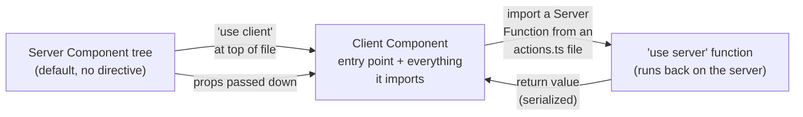

# Hooks, `"use client"`, and `"use server"`

The two directives that define where code runs, and the React hooks that only make sense on one side of that boundary. [App Router Fundamentals](App%20Router%20Fundamentals.md) covers the Server/Client Component split at a high level; this doc goes deeper on the directives themselves and the specific hooks (`useActionState`, `useFormStatus`, `useOptimistic`, `useTransition`, `use()`) that exist to bridge Client Components and Server Actions.



---

## `"use client"`: marks an entry point, not "every file with a hook"

```tsx
'use client' // must be the first line, before imports

import { useState } from 'react'

export default function Counter() {
  const [count, setCount] = useState(0)
  return <button onClick={() => setCount(count + 1)}>{count}</button>
}
```

The key thing this directive actually does: it declares a **boundary**, and the component(s) exported from that file become entry points into the client bundle. You do **not** need `"use client"` on every file a Client Component imports — only on the file that's the entry point when a Server Component renders it. A Client Component can freely import other Client Components without each one repeating the directive; it only needs to appear once, at the top of the first file that a Server Component reaches into.

### Props crossing the boundary must be serializable

Since Server → Client props cross an actual network/RSC-payload boundary, they're serialized. Functions are **not serializable** — passing a plain callback from a Server Component into a Client Component doesn't work:

```tsx
'use client'
export default function Counter({
  onClick /* ❌ Function is not serializable */,
}: { onClick: () => void }) {
  return <button onClick={onClick}>Increment</button>
}
```

| Serializable across the boundary | Not serializable |
|---|---|
| Strings, numbers, booleans, `null`/`undefined` | Plain functions/closures |
| Plain objects and arrays of the above | Class instances (Date, Map — special-cased; most custom classes are not) |
| A **Server Function** (a `"use server"`-marked function reference) | Symbols |
| React elements/JSX | — |

The one exception that looks like "passing a function" but isn't: passing a reference to a `"use server"` function (a Server Action) into a Client Component works, because React serializes it as a special reference the client can invoke back on the server — this is exactly how a Server Action ends up wired to a `<form action={...}>` in a Client Component.

---

## `"use server"`: file-level vs. inline placement

**File-level** — every exported function in the file becomes a Server Function, importable from both Server and Client Components:

```ts
// app/actions.ts
'use server'
import { db } from '@/lib/db'
import { auth } from '@/lib/auth'

export async function createUser(data: { name: string; email: string }) {
  const session = await auth()
  if (!session?.user) throw new Error('Unauthorized')
  const user = await db.user.create({ data })
  return { id: user.id, name: user.name }
}
```

```tsx
// Client Component importing it
'use client'
import { createUser } from '../actions'

export default function SignupButton() {
  return <button onClick={() => createUser({ name: 'x', email: 'y' })}>Sign up</button>
}
```

**Inline** — `'use server'` as the first line *inside* a function body, typically for a Server Action defined right next to the Server Component that uses it:

```tsx
export default async function PostPage({ params }: { params: { id: string } }) {
  const post = await getPost(params.id)

  async function updatePost(formData: FormData) {
    'use server'
    await savePost(params.id, formData)
    revalidatePath(`/posts/${params.id}`)
  }

  return <EditPost updatePostAction={updatePost} post={post} />
}
```

Both forms create the same underlying thing (React calls it a **Server Function**) — file-level is better when the same action is reused across multiple components; inline is convenient when an action is tightly scoped to one page and needs to close over that page's params.

### Security: a Server Function is a public endpoint, not a private method call

This is worth restating from [Payments Security](Payments%20Security%20%28Razorpay%20%2B%20UCP%29.md) and [Profile & Account Patterns](Profile%20%26%20Account%20Patterns.md) in directive-specific terms: calling `createUser(data)` from a Client Component *looks* like a normal function call, but it's actually a network request to a server-generated endpoint. Treat every `"use server"` function like a Route Handler:

- **Authenticate/authorize inside the function**, reading identity from `cookies()`/`headers()`/your auth library's session check — never from a parameter the client passed in (a client can pass any `userId` it wants).
- **Constrain the return value** to only what the UI needs. The return value is serialized and sent to the client just like a fetch response — returning a full database record leaks whatever fields exist on that record, not just the ones the UI happens to render.

```ts
'use server'
export async function createUser(data: { name: string; email: string }) {
  const session = await auth() // ✅ identity from the server-verified session
  if (!session?.user) throw new Error('Unauthorized')
  const newUser = await db.user.create({ data })
  return { id: newUser.id, name: newUser.name } // ✅ only what the UI needs, not the full row
}
```

---

## Where hooks work: Server Components have none

Server Components are `async` functions that render once on the server and never re-render in response to state — there is no render loop for `useState` to hook into. **No React hook works inside a Server Component**, full stop. The moment a piece of UI needs any hook, it needs a `"use client"` boundary.

| Hook | Where it works | Purpose |
|---|---|---|
| `useState`, `useReducer`, `useEffect`, `useRef`, `useContext`, `useMemo`, `useCallback` | Client Components only | Standard React state/lifecycle — same as any React app |
| `useActionState` | Client Components | Manage state driven by a Server Action / form submission |
| `useFormStatus` | Client Components (must be a **descendant** of the `<form>`, not the component rendering the form itself) | Read the pending/data/method of the nearest parent `<form>` |
| `useOptimistic` | Client Components | Show an optimistic UI update while a Server Action is in flight |
| `useTransition` | Client Components | Wrap a non-form async update (e.g. a programmatic Server Action call) as a low-priority transition |
| `use()` | Both Server and Client Components | Unwrap a Promise or read Context — can be called conditionally, unlike other hooks |

---

## `useActionState` — state driven by a Server Action

Replaces the earlier `useFormState`. Wires a Server Action to a `<form>` while tracking the resulting state and a pending flag:

```tsx
'use client'
import { useActionState } from 'react'
import { createPost } from './actions'

export function NewPostForm() {
  const [state, formAction, isPending] = useActionState(createPost, { error: null });

  return (
    <form action={formAction}>
      <input name="title" />
      <button disabled={isPending}>{isPending ? 'Saving…' : 'Create'}</button>
      {state?.error && <p>{state.error}</p>}
    </form>
  );
}
```

The action function passed to `useActionState` receives `(previousState, formData)` and returns the new state — this is how validation errors get back to the form without a full page reload or client-side fetch plumbing.

---

## `useFormStatus` — read the parent form's pending state

Must be called from a component **nested inside** the `<form>`, not the component that renders the `<form>` itself — this is the most common mistake with this hook:

```tsx
'use client'
import { useFormStatus } from 'react-dom'

function SubmitButton() {
  const { pending } = useFormStatus(); // ✅ works: SubmitButton is a child of <form>
  return <button disabled={pending}>{pending ? 'Saving…' : 'Save'}</button>;
}

export function NewPostForm() {
  return (
    <form action={createPost}>
      <input name="title" />
      <SubmitButton />
    </form>
  );
}
```

Calling `useFormStatus()` directly inside `NewPostForm` (the component that renders the `<form>` tag) always returns the default/idle state — it only reflects a form it's nested *under*, not the one it renders.

---

## `useOptimistic` — instant UI feedback before the server responds

```tsx
'use client'
import { useOptimistic, startTransition } from 'react'
import { toggleLike } from './actions'

export function LikeButton({ isLiked }: { isLiked: boolean }) {
  const [optimisticIsLiked, setOptimisticIsLiked] = useOptimistic(isLiked);

  function handleClick() {
    startTransition(async () => {
      setOptimisticIsLiked(!optimisticIsLiked); // shows instantly
      await toggleLike(!optimisticIsLiked);      // real mutation runs after
    });
  }

  return <button onClick={handleClick}>{optimisticIsLiked ? '❤️' : '🤍'}</button>;
}
```

If the Server Action throws, React reverts `optimisticIsLiked` back to the real `isLiked` value automatically — don't hand-roll a manual rollback for the common case.

---

## `use()` — the one hook that can be called conditionally

`use()` reads a Promise or Context value, and unlike every other hook it can be called inside conditionals/loops/after early returns. Its most common App Router use: unwrapping a `params`/`searchParams` promise inline instead of `await`-ing it at the top of an `async` component (see [Cache Components](Cache%20Components%20And%20Partial%20Prerendering%20%28Next.js%2016%29.md) for why pushing this down into a `<Suspense>`-wrapped child often matters more than the hook itself):

```tsx
'use client'
import { use } from 'react'

export function ProductName({ params }: { params: Promise<{ id: string }> }) {
  const { id } = use(params); // unwraps the promise without async/await
  return <span>{id}</span>;
}
```

`use()` works in Server Components too (for reading a Promise passed down as a prop), but note it does not turn a Server Component into something that can call stateful hooks — it's a Promise/Context reader, not a general escape hatch into client-only hooks.

---

## Common pitfalls

- Adding `"use client"` to every file that merely imports something with a hook, instead of only the actual entry-point component — inflates how much of the tree is treated as a client boundary (see [Performance Profiling](Performance%20Profiling%20And%20Bundle%20Analysis.md)).
- Passing a plain callback prop from a Server Component into a Client Component expecting it to work like same-process JS — it isn't serializable and will error or silently fail depending on the React version.
- Trusting a parameter passed into a `"use server"` function as identity (`userId`, `role`) instead of deriving it from a server-verified session inside the function.
- Returning a full database record from a Server Action instead of the specific fields the UI needs — the return value is serialized to the client exactly like a fetch response body.
- Calling `useFormStatus()` in the same component that renders the `<form>` — it only sees a form it's nested under, so this always returns the idle/default state.
- Reaching for `useEffect` + manual `fetch` to call a Server Action instead of `useActionState`/`useTransition` — loses the automatic pending state and progressive-enhancement behavior those hooks provide for free.

---

## Verification checklist

- [ ] `"use client"` appears only at genuine entry-point files, not propagated to every file that happens to import one
- [ ] No plain function props are passed from a Server Component into a Client Component (only serializable data, or a `"use server"` function reference)
- [ ] Every `"use server"` function authenticates/authorizes from a server-verified session, not from a client-supplied parameter
- [ ] Server Action/Function return values are shaped to exactly what the UI needs, not raw database rows
- [ ] `useFormStatus()` is called from a component nested inside the `<form>`, not the component rendering the form
- [ ] No hook is called anywhere inside an `async` Server Component

---

## References

- https://nextjs.org/docs/app/api-reference/directives/use-client
- https://nextjs.org/docs/app/api-reference/directives/use-server
- https://react.dev/reference/react/useActionState
- https://react.dev/reference/react/useOptimistic
- https://react.dev/reference/react-dom/hooks/useFormStatus
- https://react.dev/reference/react/use
