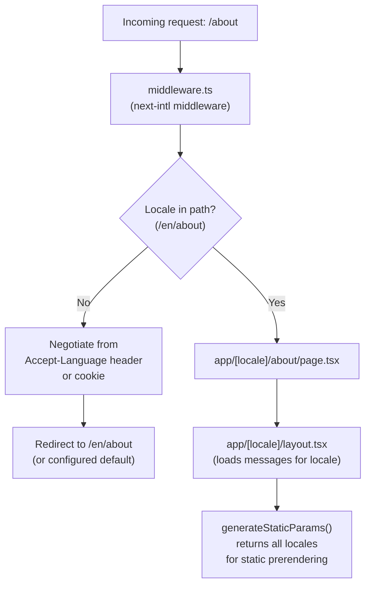

# Internationalization (i18n Routing)

The App Router has **no built-in i18n routing** (unlike the old Pages Router's `next.config.js` `i18n` block, which was removed for `app/`). Locale-aware routing in the App Router is a manual convention built from a `[locale]` dynamic segment plus middleware — this doc covers that pattern using `next-intl` as the reference library, since it's the most common choice for the App Router today.



---

## Why the App Router needs a library (or manual work) for this

Next.js 13+ deliberately dropped the Pages Router's built-in `i18n` config for `app/` because locale routing now composes with the rest of the routing system (layouts, dynamic segments, middleware) instead of being a separate framework feature. The practical result: every App Router project needs either a library (`next-intl`, `next-i18next`'s App Router mode, `@formatjs/next`) or a hand-rolled `[locale]` segment + middleware pair. `next-intl` is the most actively maintained App-Router-native option as of this writing — verify against the project's actual installed package before assuming this exact API.

---

## Folder structure

```
messages/
  en.json
  es.json
app/
  [locale]/
    layout.tsx       # loads messages for {locale}, wraps in NextIntlClientProvider
    page.tsx
    products/
      page.tsx
middleware.ts        # locale detection + redirect
i18n/request.ts       # next-intl server config (which locale, which messages)
```

Every route lives under `app/[locale]/...` — there is no route that isn't locale-prefixed. A request to `/about` with no locale segment is expected to redirect to `/en/about` (or the negotiated locale) via middleware, not be served directly.

---

## Middleware: locale detection and routing

```ts
// middleware.ts
import createMiddleware from 'next-intl/middleware';
import { routing } from './i18n/routing';

export default createMiddleware(routing);

export const config = {
  matcher: ['/((?!api|_next|_vercel|.*\\..*).*)'], // skip API routes and static assets
};
```

```ts
// i18n/routing.ts
import { defineRouting } from 'next-intl/routing';

export const routing = defineRouting({
  locales: ['en', 'es', 'fr'],
  defaultLocale: 'en',
});
```

This single middleware handles: detecting the locale from the URL, negotiating from `Accept-Language`/a locale cookie when the URL has none, and redirecting to the locale-prefixed URL.

---

## Server-side: loading messages per request

```ts
// i18n/request.ts
import { getRequestConfig } from 'next-intl/server';
import { routing } from './routing';

export default getRequestConfig(async ({ requestLocale }) => {
  const locale = (await requestLocale) ?? routing.defaultLocale;
  return {
    locale,
    messages: (await import(`../messages/${locale}.json`)).default,
  };
});
```

```tsx
// app/[locale]/layout.tsx
import { NextIntlClientProvider } from 'next-intl';
import { getMessages } from 'next-intl/server';

export default async function LocaleLayout({
  children,
  params,
}: {
  children: React.ReactNode;
  params: Promise<{ locale: string }>;
}) {
  const { locale } = await params;
  const messages = await getMessages();

  return (
    <html lang={locale}>
      <body>
        <NextIntlClientProvider messages={messages}>{children}</NextIntlClientProvider>
      </body>
    </html>
  );
}
```

`getMessages()` reads the request-scoped config set up in `i18n/request.ts` — this is a Server Component reading a per-request value, which is why locale-aware layouts are naturally dynamic per request unless static generation is explicitly set up (see below).

---

## Using translations

```tsx
// Server Component
import { getTranslations } from 'next-intl/server';

export default async function AboutPage() {
  const t = await getTranslations('AboutPage');
  return <h1>{t('title')}</h1>;
}
```

```tsx
// Client Component
'use client';
import { useTranslations } from 'next-intl';

export function Greeting() {
  const t = useTranslations('Greeting');
  return <p>{t('hello', { name: 'Alex' })}</p>;
}
```

`getTranslations` (async, server) and `useTranslations` (hook, client) read from the same `messages/<locale>.json` structure — pick based on whether the calling component is a Server or Client Component, same decision as everywhere else in the App Router (see [App Router Fundamentals](App%20Router%20Fundamentals.md)).

---

## Static generation for locales

Without `generateStaticParams`, every locale-prefixed route renders dynamically per request. To prerender each locale at build time:

```tsx
// app/[locale]/layout.tsx
import { routing } from '@/i18n/routing';

export function generateStaticParams() {
  return routing.locales.map((locale) => ({ locale }));
}
```

This tells Next.js which `[locale]` values exist so it can statically generate `/en/...`, `/es/...`, `/fr/...` at build time instead of treating `locale` as an arbitrary dynamic value resolved per request.

---

## Locale-aware links and navigation

Use the library's wrapped `Link`/`useRouter`/`redirect` instead of `next/link`/`next/navigation` directly — they automatically prefix the current locale so links don't accidentally drop the user into the wrong locale segment:

```tsx
import { Link } from '@/i18n/navigation'; // next-intl's wrapped Link, not next/link

<Link href="/about">About</Link> // resolves to /en/about, /es/about, etc. automatically
```

---

## Common pitfalls

- Using plain `next/link` instead of the i18n library's wrapped `Link` — navigation silently drops the locale prefix, sending users to an un-prefixed URL that then has to redirect again.
- Forgetting `generateStaticParams` for the `[locale]` segment — every route ends up server-rendered per request instead of statically prerendered, even for fully static marketing pages.
- Mixing `getTranslations` (server) and `useTranslations` (client) call sites without matching them to whether the component actually has `"use client"`.
- Assuming the App Router has a `next.config.ts` `i18n` block like the old Pages Router — it doesn't; this entire routing layer is manual/library-provided in `app/`.
- Not handling the "no locale in URL" case in middleware — without a redirect step, `/about` and `/en/about` can both resolve, creating duplicate-content routes.

---

## Verification checklist

- [ ] Every route lives under `app/[locale]/...` — no route bypasses the locale segment
- [ ] `middleware.ts` handles both locale detection (from URL) and negotiation (from header/cookie) with a redirect for un-prefixed paths
- [ ] `generateStaticParams` is set on the locale layout so locales are statically prerendered, not dynamically rendered per request
- [ ] All internal navigation uses the i18n library's `Link`/router wrapper, not `next/link` directly
- [ ] `<html lang={locale}>` is set dynamically per request, not hardcoded

---

## References

- https://next-intl.dev/docs/getting-started/app-router
- https://nextjs.org/docs/app/building-your-application/routing/internationalization (historical Pages Router approach, for context on what changed)
- [App Router Fundamentals](App%20Router%20Fundamentals.md)
