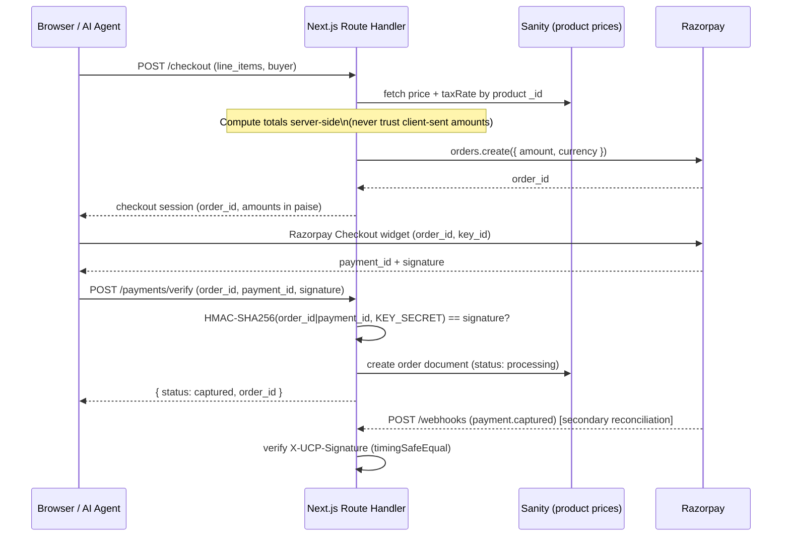

# Payments Security (Razorpay + UCP)

How `ropods-store` secures a Razorpay-based checkout, including the AI-agent-facing UCP (Universal Commerce Protocol) checkout/payments/webhook surface. Captured from the live implementation (2026-07) — read this before wiring payments into another Next.js storefront.



---

## The core principle: never trust client-sent amounts

The single most important pattern in this codebase: **the checkout route never accepts a price or total from the client.** `app/api/ucp/checkout/route.ts` takes only `product._id` + `quantity` from the request, then fetches `price` and `taxRate` from Sanity server-side to compute `subtotal`/`tax`/`total` before creating the Razorpay order:

```ts
// ✅ Server fetches the real price — client can send any product id but not any price
const products = await client.fetch(
  `*[_type == "product" && _id in $ids] { _id, name, price, taxRate, inStock }`,
  { ids: productIds },
);

const taxRateDecimal = (product.taxRate ?? 18) / 100;
const lineTotalRupees = (product.price * li.quantity) * (1 + taxRateDecimal);
```

A client (or a malicious AI agent calling the UCP endpoint) can only select *which* products and *how many* — never *what they cost*. This is the pattern to replicate in any new checkout flow: **compute the chargeable amount from your own database, not from the request body.**

---

## Amount units: paise vs rupees — don't mix them up

Razorpay's API expects amounts in **paise** (1 INR = 100 paise); Sanity's `order` schema stores amounts in **rupees**. Every route in this codebase does an explicit conversion at the boundary, and comments it inline:

```ts
// Sanity product schema: price stored in rupees (e.g. 79000 = ₹79,000)
// Razorpay order.amount: paise (e.g. 7900000)
const lineSubPaise = Math.round(lineRupees * 100);

// ...later, saving to Sanity:
price: { amount: item.price.amount / 100 } // paise → rupees for storage
```

**Gotcha:** a silent factor-of-100 bug here either overcharges the customer 100x or undercharges by 100x — always trace which unit a variable is in at each boundary (Razorpay API in/out vs Sanity read/write), and keep the inline comments that say so.

---

## Verifying a Razorpay payment

After the Razorpay Checkout widget completes, the frontend calls a verify endpoint with `razorpay_order_id`, `razorpay_payment_id`, and `razorpay_signature`. The server recomputes the expected signature and compares:

```ts
const generatedSignature = crypto
  .createHmac('sha256', process.env.RAZORPAY_KEY_SECRET!)
  .update(`${razorpay_order_id}|${razorpay_payment_id}`)
  .digest('hex');

if (generatedSignature !== razorpay_signature) {
  return NextResponse.json({ error: 'Invalid payment signature' }, { status: 400 });
}
```

This is what actually proves the payment happened — the frontend cannot forge `razorpay_signature` without `RAZORPAY_KEY_SECRET`, which never leaves the server. **Only create/update the order record after this check passes.**

### Hardening opportunity: use a constant-time comparison

The snippet above compares two hex strings with `!==`. `app/api/ucp/webhooks/route.ts` (a different endpoint in the same codebase) does this correctly with `crypto.timingSafeEqual`:

```ts
// ✅ Correct pattern — from ucp/webhooks/route.ts
return crypto.timingSafeEqual(
  Buffer.from(expected, 'hex'),
  Buffer.from(signature, 'hex'),
);
```

`!==` on strings short-circuits on the first differing byte, which in theory leaks timing information about how much of the signature an attacker has guessed correctly. The practical risk on a 64-character hex HMAC over a network call is low (network jitter dwarfs the timing signal), but it costs nothing to standardize on `timingSafeEqual` everywhere signatures are compared — **the payment-verify routes should be updated to match the webhook route's pattern.**

---

## Signed webhooks (Business ← Platform)

`app/api/ucp/webhooks/route.ts` receives asynchronous events (e.g. `payment.captured`, `order.updated`) and treats every request as untrusted until the signature checks out:

```ts
function verifySignature(body: string, signature: string | null): boolean {
  const secret = process.env.UCP_WEBHOOK_SECRET;
  if (!secret || !signature) return false;

  const expected = crypto.createHmac('sha256', secret).update(body).digest('hex');

  try {
    return crypto.timingSafeEqual(Buffer.from(expected, 'hex'), Buffer.from(signature, 'hex'));
  } catch {
    return false; // length mismatch between expected/signature throws — treat as invalid
  }
}
```

Key points:
- Reads the **raw request body** (`request.text()`) for signing, not the parsed JSON — HMACs must be computed over the exact bytes that were signed, not a re-serialized object (re-serialization can reorder keys or change whitespace, breaking the signature).
- Missing secret or missing signature header → reject, don't silently skip verification.
- `timingSafeEqual` throws if the two buffers have different lengths — caught and treated as `false`, not left to crash the handler.
- Always returns **200** once the event is accepted (even for unknown event types) — acknowledges receipt so the platform doesn't retry indefinitely, while unhandled event types are just logged for forward-compatibility.

---

## Environment variable boundaries

| Variable | Where used | Exposed to client? |
|---|---|---|
| `RAZORPAY_KEY_ID` | Server: create order, init SDK | No |
| `RAZORPAY_KEY_SECRET` | Server: create order, HMAC signature verify | **Never** — this is the actual secret that makes verification meaningful |
| `NEXT_PUBLIC_RAZORPAY_KEY_ID` | Client: Razorpay Checkout widget init | Yes — intentionally, the key **id** (not secret) is meant to be public |
| `UCP_WEBHOOK_SECRET` | Server: verify inbound webhook signatures | No |

The public/secret split mirrors Stripe's `pk_`/`sk_` convention: the *publishable* key ID identifies your account to the payment widget, but only the *secret* key can produce a valid signature — losing the key ID is not a security incident, losing the secret is.

---

## Defense in depth: explicit method allowlisting

Every payment route handler explicitly rejects non-POST methods instead of leaving them to 404/fall through:

```ts
async function handleUnsupportedMethod(request: NextRequest) {
  return NextResponse.redirect(new URL('/method-not-allowed', request.url));
}
export async function GET(request: NextRequest) { return handleUnsupportedMethod(request); }
export async function PUT(request: NextRequest) { return handleUnsupportedMethod(request); }
// ...PATCH, DELETE, HEAD, OPTIONS
```

This is a small hardening measure — it makes the endpoint's contract explicit and gives a clean, intentional response instead of relying on Next.js's default 405 body for the payment surface.

---

## Order record creation happens only after verification

Both `razorpay/verify-payment` and `ucp/payments/verify` follow the same order: **validate input → verify signature → then and only then write to Sanity.** No order document, no user account, and no confirmation email are created until the HMAC check passes. This ordering matters more than any individual line of code — if verification ever moved after the write, a forged signature could produce a real order with a `processing` status and no matching payment.

The UCP webhook's `payment.captured` handler is explicitly documented as a **secondary reconciliation path** — the primary confirmation still happens synchronously in `/payments/verify` when the buyer completes checkout. Don't treat the webhook as the only source of truth for "did this payment succeed"; it's a backstop for cases where the synchronous verify call never reaches the server (browser closed, network drop).

---

## Common pitfalls

- Trusting a client-sent `amount`/`total` anywhere in the checkout path — always recompute from the database.
- Comparing HMAC signatures with `===`/`!==` instead of `crypto.timingSafeEqual` — standardize on the timing-safe comparison everywhere signatures are checked, not just in the webhook handler.
- Mixing up paise and rupees across the Razorpay ↔ Sanity boundary — a factor-of-100 error is easy to introduce and directly affects real money.
- Writing the order record before signature verification passes.
- Logging the full `RAZORPAY_KEY_SECRET` or webhook secret anywhere, even in error logs — this codebase only ever logs a safe prefix or a boolean presence check for `RAZORPAY_KEY_ID`, never the secret.
- Treating a webhook event as authoritative without verifying its signature first — always read the raw body and verify before parsing/acting on it.

---

## Verification checklist

- [ ] Checkout amount is computed server-side from the database, never accepted from the request
- [ ] Every HMAC/signature comparison uses `crypto.timingSafeEqual`, not `===`/`!==`
- [ ] Webhook signature is verified against the **raw** request body, not a re-serialized JSON object
- [ ] Order/payment records are only written after signature verification succeeds
- [ ] Secret keys (`*_KEY_SECRET`, `*_WEBHOOK_SECRET`) never appear in logs, error messages, or client bundles
- [ ] Paise/rupee (or equivalent minor/major unit) conversions are explicit and commented at every boundary
- [ ] Non-POST methods on payment/webhook routes return an explicit, intentional response

---

## References

- https://razorpay.com/docs/payments/server-integration/nodejs/payment-gateway/build-integration/#3-verify-payment-signature
- https://nodejs.org/api/crypto.html#cryptotimingsafeequala-b
- UCP spec §Security & Authentication (Business ↔ Platform webhook signing requirement)
