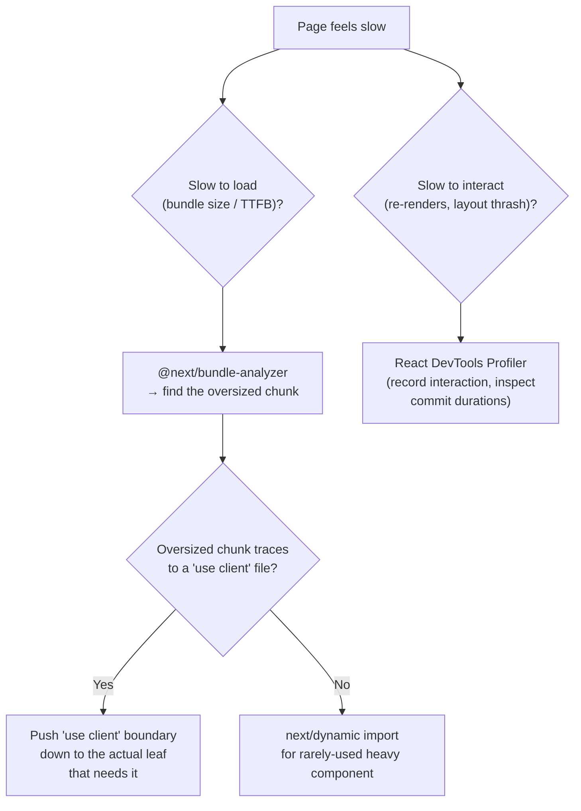

# Performance Profiling & Bundle Analysis

How to find out what's actually in a Next.js client bundle, why a page is slow, and the specific App Router patterns that most commonly cause bloat (mainly: `"use client"` boundaries placed too high in the tree).



---

## Step 1: measure before guessing

Don't optimize from intuition — profile first:

| Tool | What it shows |
|---|---|
| `@next/bundle-analyzer` | Which modules make up each client JS chunk, by size |
| Chrome DevTools → Network + Lighthouse | Actual load waterfall, Core Web Vitals (LCP, CLS, INP) for a real page load |
| React DevTools → Profiler tab | Which components re-rendered on an interaction, and how long each render took |
| `next build` output | Per-route First Load JS size, right in the terminal — check this on every PR that touches shared layout/components |

---

## Bundle analysis setup

```bash
npm install --save-dev @next/bundle-analyzer
```

```ts
// next.config.ts
import createBundleAnalyzer from '@next/bundle-analyzer';

const withBundleAnalyzer = createBundleAnalyzer({
  enabled: process.env.ANALYZE === 'true',
});

export default withBundleAnalyzer({
  // ...rest of next config
});
```

```bash
ANALYZE=true npm run build
```

This opens an interactive treemap per chunk after the build — look for: a single large third-party dependency dominating a route's chunk, or the same dependency duplicated across multiple chunks (a sign it's imported in multiple client boundaries instead of shared).

---

## The #1 App Router bundle-bloat cause: `"use client"` placed too high

```tsx
// ❌ Bloats the bundle: the whole page (including all its data-heavy
// child content) becomes client-side just because of one date picker
'use client';
export default function EventPage({ event }) {
  return (
    <div>
      <EventHeader event={event} />
      <EventDescription event={event} />
      <DatePicker /> {/* the only thing that actually needs client JS */}
    </div>
  );
}
```

```tsx
// ✅ Server Component stays a Server Component; only the interactive
// leaf carries "use client" and its bundle cost
export default function EventPage({ event }) {
  return (
    <div>
      <EventHeader event={event} />
      <EventDescription event={event} />
      <DatePickerWidget /> {/* this file alone has "use client" */}
    </div>
  );
}
```

Every import inside a `"use client"` file (transitively, unless that import has its own Server Component boundary) ships to the browser. A single `"use client"` at the top of a page-level file can silently pull a heavy chart/date/rich-text library into every visitor's initial load, even though only one small widget uses it. See [App Router Fundamentals](App%20Router%20Fundamentals.md) for the underlying Server/Client Component model — this doc covers detecting and fixing the bundle-size symptom.

---

## `next/dynamic` for rarely-used heavy components

For components that are genuinely heavy and only needed conditionally (a rich text editor that only renders after clicking "Edit", a chart library only shown on one admin page):

```tsx
import dynamic from 'next/dynamic';

const RichTextEditor = dynamic(() => import('./RichTextEditor'), {
  ssr: false, // skip server rendering entirely if it's client-only anyway
  loading: () => <EditorSkeleton />,
});
```

This splits the component into its own chunk, loaded only when it actually renders — not bundled into the parent's initial JS. Reach for this after confirming (via the bundle analyzer) that a specific import is actually large; don't reflexively wrap every component in `dynamic()`, since it adds a loading-state complexity cost for components that are small enough not to matter.

---

## Common library-import bloat patterns

| Pattern | Problem | Fix |
|---|---|---|
| `import _ from 'lodash'` | Pulls in the entire library even if only `debounce` is used | `import debounce from 'lodash/debounce'`, or use a native equivalent |
| `import * as Icons from 'react-icons/fa'` | Barrel import can defeat tree-shaking depending on bundler config | Import individual icons: `import { FaCartShopping } from 'react-icons/fa6'` |
| A moment.js/date-fns full import for one date format | Large library for a small need | `date-fns` already tree-shakes per-function by design; moment.js does not — consider migrating |
| A chart library imported at the top of a page that rarely shows a chart | Ships to every visitor of that route | `next/dynamic` with `ssr: false` |

---

## Reading `next build` output

```
Route (app)                              Size     First Load JS
┌ ○ /                                    5.2 kB          142 kB
├ ○ /products                            8.1 kB          148 kB
└ ƒ /products/[id]                       3.4 kB          139 kB
```

- **Size** — this route's own code.
- **First Load JS** — everything the browser must download for this route on a cold visit, including shared chunks. This is the number that actually correlates with load performance — watch it in PR review for unexpected jumps after adding a dependency.
- `○` (Static) vs `ƒ` (Dynamic) — confirms whether a route ended up statically prerendered or server-rendered per request; an unexpectedly `ƒ` route is worth checking against [Data Fetching And Caching](Data%20Fetching%20And%20Caching.md) (something in it is likely reading `cookies()`/`headers()` or an uncached `fetch`).

---

## Common pitfalls

- Profiling against `next dev` — dev mode is unminified and uninstrumented differently than production; always measure bundle size and Web Vitals against a production build (`next build && next start`).
- Wrapping every component in `next/dynamic` "just in case" — adds complexity without benefit for components that were never large to begin with; use the analyzer to find real offenders first.
- Fixing bundle size by removing a Client Component's functionality instead of moving the `"use client"` boundary down — the actual fix is almost always "which file has the directive," not "do less."
- Ignoring the First Load JS regression on a PR because the new route's own `Size` column looks small — the shared-chunk increase from a new dependency often shows up on *other* routes too.

---

## Verification checklist

- [ ] Ran `@next/bundle-analyzer` and identified what's actually in the largest chunks before making changes
- [ ] Every `"use client"` directive is on the smallest component that genuinely needs it, not a parent/page-level file
- [ ] Heavy, conditionally-rendered components use `next/dynamic` (with `ssr: false` if truly client-only)
- [ ] Checked `next build`'s First Load JS output for unexpected increases after adding a dependency
- [ ] Measured against a production build (`next build && next start`), not `next dev`

---

## References

- https://nextjs.org/docs/app/building-your-application/optimizing/bundle-analyzer
- https://nextjs.org/docs/app/building-your-application/optimizing/lazy-loading
- [App Router Fundamentals](App%20Router%20Fundamentals.md)
