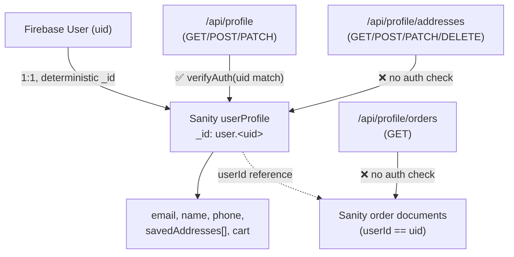

# Profile & Account Patterns

How `ropods-store` models the app-level user profile on top of Firebase Auth: a Sanity `userProfile` document keyed deterministically by Firebase UID, plus `addresses` and `orders` sub-resources. Captured from the live implementation (2026-07) — **includes an unresolved authorization gap, flagged below, not yet fixed in the source repo.**



---

## The profile document

A Sanity `userProfile` document is created lazily on first sign-in (see [Authentication Patterns](Authentication%20Patterns%20%28Firebase%29.md)), with a **deterministic document ID** derived from the Firebase UID:

```ts
const newProfile = await writeClient.createIfNotExists({
  _id: `user.${userId}`, // deterministic ID — prevents duplicate profiles for the same user
  _type: 'userProfile',
  userId,
  email,
  name: name || '',
  phone: phone || '',
  savedAddresses: [],
  createdAt: new Date().toISOString(),
  updatedAt: new Date().toISOString(),
});
```

`createIfNotExists` plus a deterministic `_id` makes profile creation **idempotent** — calling it twice for the same UID (e.g. a race between two tabs both hitting the 404-then-create path) can't produce two profile documents. This is the pattern to reuse anywhere a "create if missing" flow is triggered from client-side logic rather than a single controlled server action: derive the ID from the immutable external identity (Firebase UID), don't generate a random one and rely on a uniqueness query first.

The route (`/api/profile`) enforces ownership correctly on every verb:

```ts
const authResult = await verifyAuth(request, userId); // checks decodedToken.uid === userId
if (!authResult) return unauthorized();
if ('error' in authResult) return forbidden(authResult.error);
```

GET, POST, and PATCH on `/api/profile` all call this before touching Sanity. **This is the correct pattern** — treat it as the template for any new profile-adjacent route.

---

## ⚠️ Unresolved finding: sub-resources skip the ownership check

`/api/profile/addresses/route.ts` (GET/POST/PATCH/DELETE) and `/api/profile/orders/route.ts` (GET) read `userId` straight from the query string or request body and **never call `verifyAuth`, never check an `Authorization` header, and never verify a Firebase ID token.** There is also no `middleware.ts` covering `/api/*` — this project's `proxy.ts` (its middleware-equivalent) explicitly excludes `api` from its matcher:

```ts
export const config = {
  matcher: ['/((?!api|_next/static|_next/image|favicon.ico).*)'], // api routes are NOT covered
};
```

Concretely, today, an unauthenticated request like:

```
GET /api/profile/orders?userId=<any-firebase-uid>&limit=50
GET /api/profile/addresses?userId=<any-firebase-uid>
DELETE /api/profile/addresses?userId=<any-firebase-uid>&addressIndex=0
```

returns that user's **full order history (shipping address, items, totals)** or lets a caller **read, add, modify, or delete another user's saved addresses** — no token required, just a guessed or leaked UID. This is a classic **IDOR (Insecure Direct Object Reference)**: the resource is looked up by an ID supplied in the request with no check that the caller is entitled to that ID.

It is *not* mitigated by these routes being uncalled from the current UI — grep confirms no component in this codebase currently calls `/api/profile/orders` or `/api/profile/addresses` — **but a `route.ts` file is a live, publicly reachable HTTP endpoint the moment it's deployed, regardless of whether your own frontend links to it.** "Nothing in our UI calls this" is not a security control.

**The fix is small and already exists in the same codebase** — copy the `verifyAuth` helper from `app/api/profile/route.ts` into both files and call it before touching Sanity:

```ts
// Add to both addresses/route.ts and orders/route.ts
const authResult = await verifyAuth(request, userId);
if (!authResult) return NextResponse.json({ success: false, error: 'Unauthorized' }, { status: 401 });
if ('error' in authResult) return NextResponse.json({ success: false, error: authResult.error }, { status: authResult.status });
```

This is documented here rather than silently patched, since it lives in a separate repo (`ropods-store`) from this skills library — **fix it there directly if this doc is being read in the context of that project.**

---

## Address sub-resource shape

Addresses are stored as an array on the profile document, not as separate Sanity documents — reasonable for a bounded, per-user list (typically single digits):

```ts
savedAddresses: [
  { _key: '...', name, line1, line2, city, state, postalCode, country, phone, isDefault },
]
```

Two invariants the route logic maintains manually (since Sanity arrays have no unique/exclusive constraint):
- **Exactly one `isDefault: true`** — every write path that sets a new default first clears `isDefault` on all other entries in the same array before adding/updating.
- **Every array element needs a Sanity `_key`** — generated with `addr._key || Math.random().toString(36).substring(2, 11)` if missing, since Sanity requires array items to have a `_key` for patch operations to target them individually.

---

## Order history sub-resource

`/api/profile/orders` queries `order` documents (a separate top-level Sanity type — see [Payments Security](Payments%20Security%20%28Razorpay%20%2B%20UCP%29.md) for how orders are created) filtered by `userId`, with manual pagination:

```ts
const query = `{
  "orders": *[_type == "order" && userId == $userId] | order(_createdAt desc) [$offset...$end] { ... },
  "total": count(*[_type == "order" && userId == $userId])
}`;
```

A single GROQ query returns both the page of results and the total count in one round trip — avoids a separate count query. `hasMore: offset + limit < result.total` is computed from that same response rather than a second request.

---

## Common pitfalls

- Adding a new sub-route under an authenticated resource (`/api/profile/*`) without copying the parent route's auth check — **this is exactly the bug present in this codebase today**, see above.
- Assuming route-level middleware protects API routes — check the actual `matcher` config; a global middleware that excludes `/api` protects nothing there.
- Assuming "no UI caller" means "not exploitable" — any deployed `route.ts` is reachable directly over HTTP.
- Forgetting to maintain the "exactly one default" invariant when adding array-based sub-resources with a boolean flag — clear the flag on siblings before setting it on the new/updated entry.
- Missing `_key` on array items before a Sanity `.patch().set()` — the write will fail or produce unaddressable array entries.

---

## Verification checklist

- [ ] Every route under an authenticated resource path calls the same ownership check as its parent route — check this explicitly per file, not per feature area
- [ ] Confirmed the project's `middleware.ts`/`proxy.ts` matcher actually covers the paths you assume it protects (check for `api` exclusions)
- [ ] No route trusts a `userId` (or any resource-owner identifier) from the request without verifying it against a server-verified token
- [ ] Array-based sub-resources with an "is default" flag maintain the single-default invariant on every write
- [ ] Every Sanity array item has a `_key` before a patch targets it

---

## References

- https://owasp.org/www-project-top-ten/2017/A5_2017-Broken_Access_Control (IDOR)
- [Authentication Patterns (Firebase)](Authentication%20Patterns%20%28Firebase%29.md)
- [Payments Security (Razorpay + UCP)](Payments%20Security%20%28Razorpay%20%2B%20UCP%29.md)
