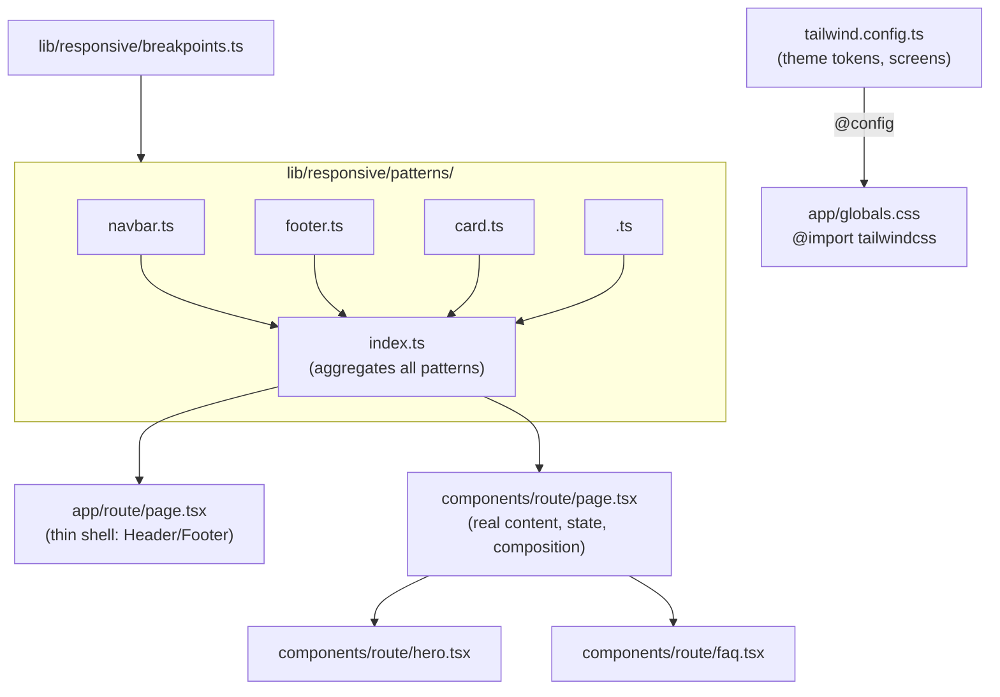
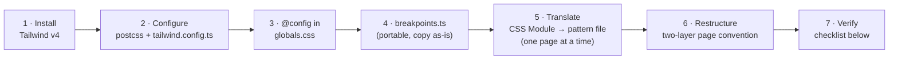

# Tailwind Patterns Architecture

A reusable Next.js styling architecture: Tailwind v4 plus a centralized `lib/responsive/patterns/` folder, and a two-layer `app/<route>/page.tsx` shell + `components/<route>/page.tsx` orchestrator convention.carried over to `cielon-eshop` and other projects that want "one central point" for styling instead of scattered CSS Modules.



---

## When to use this

- User wants to consolidate scattered CSS Modules into "one central point"
- User wants a project restructured to mirror another project's patterns/components/app architecture
- User is setting up a new Next.js project and wants this architecture from the start
- User mentions "responsive patterns", "patterns folder", or asks to migrate to Tailwind

---

## The target architecture

```
lib/responsive/
  breakpoints.ts        # sm/md/lg/xl/2xl/3xl/4xl + device-type helpers (mirror tailwind.config.ts screens)
  patterns/
    index.ts            # aggregates every pattern file into one `patterns` export
    navbar.ts, footer.ts, card.ts, section.ts   # shared/generic
    <feature>.ts         # one file per page or shared component
    <page>/               # subfolder when a page has multiple sections
      index.ts, hero.ts, faq.ts, ...

app/<route>/page.tsx      # thin shell: layout chrome (Header/Footer) + the orchestrator
components/<route>/page.tsx  # the real content: state, data, composition of section components
components/<route>/<section>.tsx  # one component per page section, for complex pages (e.g. home)
```

Each pattern file exports a plain object of Tailwind class strings keyed by element name:

```ts
export const navbarPatterns = {
  header: "fixed top-0 left-0 w-full z-[1000] transition-all duration-300 px-4 sm:px-8 py-4",
  navLink: "text-sm font-medium tracking-[1.5px] uppercase relative py-1 hover:!text-terracotta ...",
};
```

Components import it and use it exactly like a CSS Module (`styles.header` → `p.header`), which keeps a class-string-only migration mechanical: swap the import, keep every `className={styles.x}` reference as `className={p.x}`.

---

## Step-by-step



1. **Install Tailwind v4**: `npm install tailwindcss @tailwindcss/postcss`
2. **`postcss.config.mjs`**:
   ```js
   export default { plugins: { "@tailwindcss/postcss": {} } };
   ```
3. **`tailwind.config.ts`**: set `content` globs (`app`, `components`, `lib`), extend `screens` if the project needs breakpoints beyond Tailwind defaults, and map the project's *existing* design tokens (CSS custom properties) into `theme.extend.colors` / `borderRadius` / `boxShadow` — don't invent new values, reuse what's in `:root`.
4. **CSS entry file** (`app/globals.css` or equivalent):
   ```css
   @import "tailwindcss";
   @config "../tailwind.config.ts";   /* see gotcha #1 below — do not skip this */
   :root { /* existing tokens, unchanged */ }
   ```
5. **Check for a free spacing-scale mapping** before adding custom spacing tokens — see gotcha #2.
6. Build `lib/responsive/breakpoints.ts` (generic, portable across projects — copy as-is, adjust breakpoint values to match `tailwind.config.ts` screens).
7. Translate CSS Modules to pattern files, one page/component at a time. For each:
   - Read the `.module.css` file fully first
   - Write the equivalent Tailwind pattern object (arbitrary values `[...]` for anything without a clean utility, CSS var references for colors/shadows already mapped in step 3)
   - Rewrite the component to import the pattern instead of the CSS Module
   - Delete the `.module.css` file
   - **Run `next build` after each page**, not just at the end — catches broken imports immediately
8. Restructure each route into the two-layer convention (above) if not already done.
9. Verify per the checklist below, not just "build succeeded."

---

## Gotchas (hard-won, don't skip)

**1. Tailwind v4 silently ignores `tailwind.config.ts` without `@config`.**
The postcss plugin does not auto-load a JS/TS config. Without the `@config "../tailwind.config.ts";` line in the CSS entry file, `content` globs and `theme.extend` are ignored — the build still succeeds and pages still return 200, but almost no utility classes actually generate (not even `.flex{}`). This fails completely invisibly. If you change `@config` or the config file while a Turbopack dev server is running, it may not hot-reload — kill the process, delete `.next/`, restart.

**Verify Tailwind is actually generating classes** (don't trust build success or HTTP 200 alone):
```bash
curl -s http://localhost:3000/ | grep -o '/_next/static/chunks/[^"]*\.css'
curl -s "http://localhost:3000/_next/static/chunks/<that-file>" | grep -A1 '\.your-custom-class '
```
You should see the real CSS rule, not zero matches.

**2. Check whether existing spacing/radius tokens already match Tailwind's default scale.**
Tailwind's default spacing scale is `1=4px, 2=8px, 4=16px, 6=24px, 8=32px, 16=64px`. If a project's `--spacing-xs/sm/md/lg/xl/xxl` already land on those exact values (common for projects that eyeballed a similar scale), use Tailwind's default utilities (`p-4`, `gap-8`) directly instead of adding redundant custom spacing tokens. Same check applies to border-radius (4/8/16px = `rounded`/`rounded-lg`/`rounded-2xl`).

**3. Keep runtime-computed values as inline styles.**
Pattern files hold *static* strings only. Anything computed at render time — a per-item color from data, a font size derived from a numeric prop — stays as `style={{...}}`. Don't try to force it into a Tailwind arbitrary-value class; Tailwind's scanner needs static strings to detect classes at build time, so a dynamically-interpolated class name won't even generate the CSS.

**4. Verify a CSS Module is actually imported before migrating it.**
Projects accumulate orphaned `.module.css` files after refactors that switched a component to inline styles without deleting the old file. Grep for the import before spending time translating it.

**5. Icon-library conversion should skip brand marks and decorative artwork.**
When swapping hand-rolled inline SVGs for an icon library (e.g. `react-icons`), only convert generic UI icons (cart, chevron, social, shield, info). Leave brand logos and custom illustrative SVGs (textures, line-art) as hand-written SVG — an icon library has no equivalent for bespoke artwork.

**6. The two-layer page convention is pure file organization, not a framework feature.**
`app/<route>/page.tsx` (shell) + `components/<route>/page.tsx` (content) is just a naming/structure convention. Adopting it is a mechanical file-move once content is already componentized. Nearly all migration risk lives in the CSS Module → Tailwind class translation, not in this restructuring.

---

## Verification checklist

- [ ] `next build` passes (TypeScript + all routes)
- [ ] `find . -iname "*.module.css"` (excluding node_modules/.next) returns nothing, unless some were intentionally kept
- [ ] Compiled CSS chunk contains real rules for your custom classes (see gotcha #1's curl command)
- [ ] Dev server serves every route at 200 with expected content (curl + grep for known text)
- [ ] No console/server errors in the dev server log
- [ ] Spot-check at least one page visually (browser preview or screenshot) if the environment supports it

---

## References

- https://tailwindcss.com/docs/v4-beta
- Derived from migrating `cielon-eshop` to match `ropods-website`'s architecture (2026-07)
