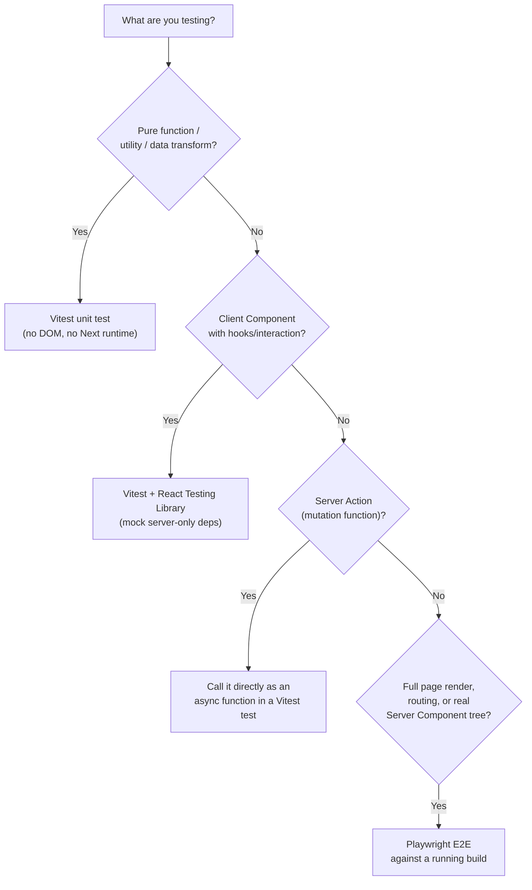

# Testing Strategies (Vitest + Playwright)

How to test a Next.js App Router codebase: what's realistically unit-testable (Client Components, pure functions, Server Actions called directly) versus what needs an end-to-end browser test (anything involving Server Component rendering, routing, or real navigation).



---

## The core constraint: Server Components don't render in Vitest/RTL

React Testing Library renders components with `react-dom` in a JSDOM environment on the client — it has no concept of the Server Component render pipeline (RSC payloads, `async` component functions resolved on the server, streaming). **An `async` Server Component cannot be unit-tested the way a Client Component can.** There is no supported way to `render()` an `async function Page()` with RTL and get meaningful output.

The practical split:

| What it is | How to test it |
|---|---|
| `async function Page()` that fetches data and renders | Playwright E2E against a running `next build`/`next start` — this is the only reliable way to exercise the actual render |
| A pure function extracted from that page (e.g. `formatPrice`, `calculateTax`) | Vitest unit test — extract logic out of the Server Component into a plain function specifically so it's unit-testable |
| A Client Component (`"use client"`) with hooks/handlers | Vitest + React Testing Library, same as any React app |
| A Server Action (`'use server'` function) | Call it directly in a Vitest test — it's just an async function, no special harness needed |

**Design implication:** push business logic (pricing, validation, formatting) into plain exported functions rather than inlining it in a Server Component body — not for "clean code" reasons in the abstract, but specifically so it has a unit-test path that doesn't require a browser.

---

## Vitest setup for the App Router

```ts
// vitest.config.ts
import { defineConfig } from 'vitest/config';
import react from '@vitejs/plugin-react';
import tsconfigPaths from 'vite-tsconfig-paths';

export default defineConfig({
  plugins: [react(), tsconfigPaths()],
  test: {
    environment: 'jsdom',
    setupFiles: ['./vitest.setup.ts'],
  },
});
```

```ts
// vitest.setup.ts
import '@testing-library/jest-dom/vitest';
```

Testing a Client Component:

```tsx
// components/AddToCartButton.test.tsx
import { render, screen, fireEvent } from '@testing-library/react';
import { describe, it, expect, vi } from 'vitest';
import { AddToCartButton } from './AddToCartButton';

describe('AddToCartButton', () => {
  it('shows pending state while the action runs', async () => {
    render(<AddToCartButton productId="123" />);
    fireEvent.click(screen.getByRole('button', { name: /add to cart/i }));
    expect(await screen.findByText(/adding/i)).toBeInTheDocument();
  });
});
```

Testing a Server Action directly:

```ts
// app/actions.test.ts
import { describe, it, expect, vi } from 'vitest';
import { createPost } from './actions';

vi.mock('@/lib/db', () => ({ db: { post: { create: vi.fn() } } }));
vi.mock('next/cache', () => ({ revalidatePath: vi.fn() }));

describe('createPost', () => {
  it('rejects an empty title', async () => {
    const formData = new FormData();
    formData.set('title', '');
    await expect(createPost(formData)).rejects.toThrow(/title is required/i);
  });
});
```

Server Actions call `next/cache` (`revalidatePath`/`revalidateTag`) and often `next/headers` (`cookies()`, `headers()`) — both throw outside a real Next.js request context, so **mock them** in unit tests rather than trying to construct a real request context.

---

## Playwright setup for E2E

```ts
// playwright.config.ts
import { defineConfig } from '@playwright/test';

export default defineConfig({
  testDir: './e2e',
  webServer: {
    command: 'npm run build && npm run start',
    url: 'http://localhost:3000',
    reuseExistingServer: !process.env.CI,
    timeout: 120_000,
  },
  use: { baseURL: 'http://localhost:3000' },
});
```

```ts
// e2e/checkout.spec.ts
import { test, expect } from '@playwright/test';

test('user can complete checkout', async ({ page }) => {
  await page.goto('/products/widget');
  await page.getByRole('button', { name: 'Add to cart' }).click();
  await page.goto('/checkout');
  await page.getByLabel('Email').fill('test@example.com');
  await page.getByRole('button', { name: 'Place order' }).click();
  await expect(page.getByText('Order confirmed')).toBeVisible();
});
```

**Test against `next build && next start`, not `next dev`.** Dev mode has different caching, compilation, and error-overlay behavior — a test suite that only ever runs against `next dev` can pass locally and fail against what's actually deployed. The `webServer` config above builds first.

---

## Mocking the data layer

For E2E tests, prefer **seeding a real (test) database or hitting a real staging API** over mocking network calls — Playwright tests are meant to catch integration issues that unit tests can't, and mocking too aggressively defeats that purpose. For unit tests (Vitest), mock at the module boundary (`vi.mock('@/lib/db', ...)`) rather than mocking `fetch` globally, which is harder to keep in sync with real response shapes.

---

## CI considerations

- Run `next build` once and reuse it for both a production smoke test and the Playwright suite — don't rebuild per test file.
- Cache `node_modules` and the Next.js build cache (`.next/cache`) between CI runs to keep build times down.
- Run Vitest and Playwright as separate CI jobs/steps — Vitest is fast and should gate quickly; Playwright (browser installs, real server boot) is slower and can run in parallel or as a separate stage.

---

## Common pitfalls

- Trying to `render()` an `async` Server Component with React Testing Library — it doesn't work; extract logic into plain functions or test via Playwright instead.
- Running the E2E suite only against `next dev` — behavior (caching, error boundaries) can differ from the production build.
- Calling `cookies()`/`headers()`/`revalidatePath()` inside a unit-tested function without mocking them — they throw outside a real request context.
- Over-mocking in Playwright tests until they no longer test anything real — if everything is mocked, an E2E test provides the same confidence as a unit test at higher cost.
- Not extracting business logic out of Server Components — leaves genuinely important logic (pricing, validation) with no fast unit-test path.

---

## Verification checklist

- [ ] Business logic used inside Server Components is extracted into plain, independently unit-tested functions
- [ ] Client Components with interaction have Vitest + RTL coverage for their key states (loading, error, success)
- [ ] Server Actions are tested directly as functions, with `next/cache` and `next/headers` mocked
- [ ] E2E suite runs against `next build && next start`, not `next dev`
- [ ] CI caches `node_modules` and `.next/cache` between runs

---

## References

- https://nextjs.org/docs/app/building-your-application/testing/vitest
- https://nextjs.org/docs/app/building-your-application/testing/playwright
- https://playwright.dev/docs/test-configuration
