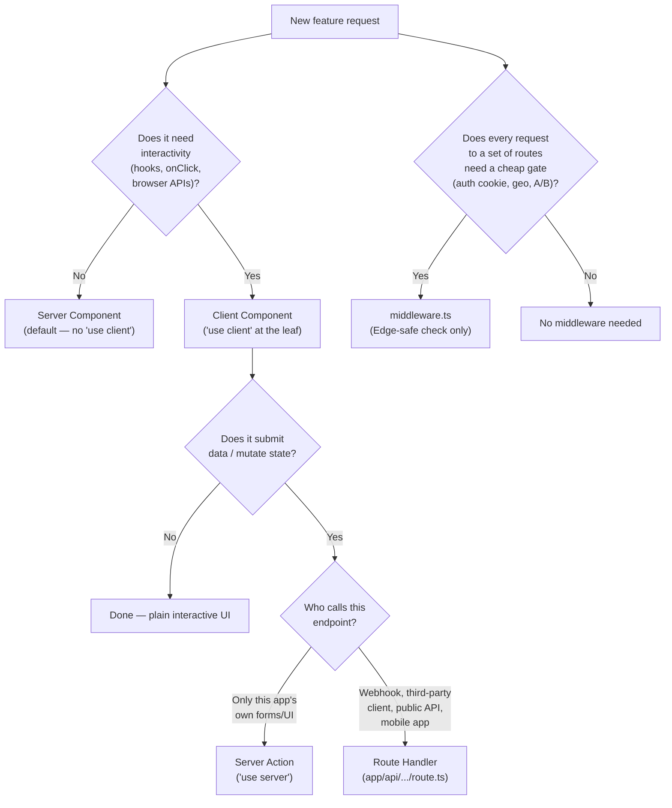
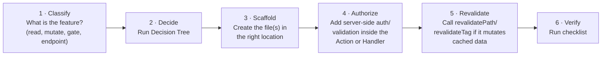

# Next.js Primitive Picker — Agent Skill

---

## AGENT RULES

1. **Never default to Client Component out of habit.** Start every new component as a Server Component; only add `"use client"` when a concrete requirement (hook, event handler, browser API) forces it.
2. **Never build a Route Handler for a mutation only your own UI calls.** Use a Server Action instead — it's simpler and gets progressive enhancement for free.
3. **Never skip server-side authorization in a Server Action or Route Handler** because "the UI already checks it." Both are public endpoints regardless of how they're invoked from the client.
4. **Never put database queries or Node-only packages in `middleware.ts`.** It runs on the Edge runtime — no exceptions, no polyfill workaround worth reaching for.
5. **Always call `revalidatePath`/`revalidateTag` after a mutation** that should be reflected in previously-cached UI — don't leave the user staring at stale data after a successful action.

---

## Decision Tree



---

## Decision Table — Pick the Right Primitive

| What you're building | Primitive | Why |
|---|---|---|
| A page that only reads and displays data | Server Component | Zero client JS, can `await` data directly |
| A dropdown, modal, or form with local state | Client Component | Needs hooks/event handlers |
| A form submit that only your app's UI calls | Server Action | Simplest, progressive enhancement, no separate endpoint |
| A Stripe/GitHub webhook receiver | Route Handler | External caller, needs specific HTTP semantics |
| A public API consumed by a mobile app or third party | Route Handler | Needs stable HTTP contract, not tied to React |
| Redirecting unauthenticated users away from `/dashboard/*` | Middleware (cheap cookie check) + real validation in the page/action | Middleware is Edge-only; heavy validation belongs server-side downstream |
| A dashboard needing two independently-loading panels | Parallel routes (`@slot`) | Each slot streams independently with its own `loading.tsx` |
| A "photo modal that's also a full page on refresh" | Intercepting route + parallel route | Standard combo for this exact pattern |

---

## Step-by-Step Execution



### Step 1 — Classify

Read the request. Is it: a read-only view, an interactive widget, a data mutation, a route-gating rule, or an externally-called endpoint? This determines which branch of the Decision Tree applies.

### Step 2 — Decide

Walk the Decision Tree above. Do not ask the user which primitive to use — the tree resolves it from the requirement.

### Step 3 — Scaffold

**Server Component (default):**
```tsx
// app/products/page.tsx — no directive needed
export default async function ProductsPage() {
  const products = await db.product.findMany()
  return <ProductList products={products} />
}
```

**Client Component (only the interactive leaf):**
```tsx
// components/AddToCartButton.tsx
'use client'
export function AddToCartButton({ productId }: { productId: string }) {
  const [pending, setPending] = useState(false)
  // ...
}
```

**Server Action:**
```ts
// app/actions.ts
'use server'
export async function addToCart(formData: FormData) {
  // auth + validation here
  await cart.add(formData.get('productId') as string)
  revalidatePath('/cart')
}
```

**Route Handler:**
```ts
// app/api/webhooks/stripe/route.ts
export async function POST(request: NextRequest) {
  const sig = request.headers.get('stripe-signature')
  // verify signature, process event
  return NextResponse.json({ received: true })
}
```

**Middleware:**
```ts
// middleware.ts
export function middleware(request: NextRequest) {
  const token = request.cookies.get('session')?.value
  if (!token) return NextResponse.redirect(new URL('/login', request.url))
  return NextResponse.next()
}
export const config = { matcher: ['/dashboard/:path*'] }
```

### Step 4 — Authorize

Every Server Action and Route Handler re-checks authorization internally — never assume the caller is your own authenticated UI. Middleware only gates on cheap, Edge-safe signals (cookie presence); real validation happens downstream.

### Step 5 — Revalidate

If the action/handler changed data that's rendered elsewhere, call `revalidatePath('/path')` or `revalidateTag('tag')` before returning — otherwise the user sees stale cached content after a successful mutation.

### Step 6 — Verify

Run the checklist below before reporting the feature done.

---

## NEVER Do These

```tsx
// ❌ Never mark a whole page "use client" just because one button needs a hook
'use client'
export default function ProductsPage() { /* fetches data + renders everything */ }

// ❌ Never build a Route Handler for a same-app-only mutation
// app/api/add-to-cart/route.ts — unnecessary; use a Server Action instead

// ❌ Never skip authorization in a Server Action because "the button is only shown to admins"
'use server'
export async function deleteProduct(id: string) {
  await db.product.delete({ where: { id } }) // no auth check — anyone can call this action directly
}

// ❌ Never import a Node-only DB client in middleware.ts
import { PrismaClient } from '@prisma/client' // fails — middleware is Edge-only

// ❌ Never forget revalidation after a mutation
'use server'
export async function updatePost(id: string, data: FormData) {
  await db.post.update({ where: { id }, data: { title: data.get('title') } })
  // missing: revalidatePath('/posts') — list page now shows stale title
}
```

---

## Verify Your Output

Before reporting done, confirm every item:

- [ ] New components default to Server Components; `"use client"` only on the leaf(s) that need it
- [ ] Mutations invoked only by this app's own UI use a Server Action, not a Route Handler
- [ ] Externally-called endpoints (webhooks, public API, mobile clients) use a Route Handler
- [ ] Every Server Action / Route Handler re-validates authorization server-side
- [ ] `middleware.ts` contains no Node-only imports or DB calls
- [ ] Mutations call `revalidatePath`/`revalidateTag` for any cached view they affect
- [ ] Checked the installed Next.js major version before relying on caching defaults or `params` typing
